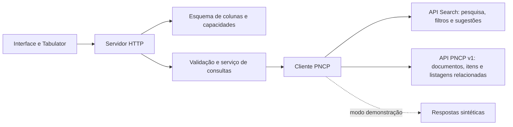

# Arquitetura e organização do código

O Compras Web é um serviço Node.js que entrega arquivos estáticos e uma API HTTP na mesma origem. A interface consulta essa API; o backend valida os critérios, acessa o PNCP por HTTPS e projeta os resultados para a tabela e o CSV.

## Componentes

| Arquivo ou diretório | Responsabilidade |
| --- | --- |
| [`src/server.js`](../src/server.js) | Rotas, arquivos estáticos, cabeçalhos HTTP, limite de operações, cancelamento e logs |
| [`src/config.js`](../src/config.js) | Padrões e validação das variáveis de configuração |
| [`src/schema.js`](../src/schema.js) e [`src/pncp-arguments.json`](../src/pncp-arguments.json) | Colunas, catálogo de argumentos, tipos e capacidades habilitadas |
| [`src/filter-domains.js`](../src/filter-domains.js) | Provedores de domínios, listas parciais, rótulos, grupos e exemplos de entrada |
| [`src/validation.js`](../src/validation.js) | Validação de consultas, filtros, datas, decimais e intervalos |
| [`src/query.js`](../src/query.js) | Consulta de página, verificação de domínios, coleta para CSV e paginação dos detalhes |
| [`src/pncp.js`](../src/pncp.js) | Cliente HTTPS, filas, ritmo de chamadas, tentativas, timeouts e leitura das respostas |
| [`src/adapter.js`](../src/adapter.js) | Projeção dos documentos, precisão numérica, identidades e normalização de links |
| [`src/related.js`](../src/related.js) | Projeção de arquivos, atas, contratos vinculados e histórico, com links e valores exatos |
| [`src/document-details.js`](../src/document-details.js) | Identidades e caminhos por tipo, campos completos de atas/contratos e campos de registros relacionados |
| [`src/errors.js`](../src/errors.js) | Erros com código, status HTTP e detalhes |
| [`src/demo.js`](../src/demo.js) | Fonte sintética ativada explicitamente |
| [`public/`](../public/) | HTML, estilos e interação da interface em JavaScript |
| [`scripts/dev.js`](../scripts/dev.js), [`src/dev-reload.js`](../src/dev-reload.js) e [`public/dev-reload.js`](../public/dev-reload.js) | Reinício do servidor e recarga da página no desenvolvimento |
| [`scripts/build.js`](../scripts/build.js) | Preparação de `dist/` por cópia dos arquivos necessários |
| [`test/`](../test/) | Testes do contrato, serviço, HTTP, interface e recarga automática |
| [`Dockerfile`](../Dockerfile) e [`.railway/railway.ts`](../.railway/railway.ts) | Empacotamento e configuração de implantação |

O servidor usa `node:http` sem framework web. Undici faz as requisições, `lossless-json` preserva valores numéricos da fonte, e Tabulator apresenta os dados. A dependência de desenvolvimento `railway` fornece o SDK de infraestrutura.

## Fluxo de dados

1. A interface carrega `/api/schema`, configura colunas e filtros e inicia a primeira pesquisa.
2. `/api/query` valida o corpo, os tipos e as capacidades. Domínios fechados são conferidos antes da busca, com `/filters` ou catálogos auxiliares; listas parciais são tratadas separadamente.
3. O cliente limita a concorrência e o ritmo das chamadas, aplica timeouts e lê JSON preservando a precisão numérica.
4. A busca confere o tipo documental, o total e a quantidade de registros. O adaptador produz as colunas, a identidade e os identificadores originais de cada tipo documental. Atas preservam tanto o sequencial da compra quanto o sequencial da ata; contratos preservam seu próprio sequencial.
5. A interface aplica a resposta se ela ainda corresponder à operação atual. Pesquisa, detalhes e exportação possuem controle de cancelamento; respostas atrasadas não substituem uma consulta mais recente.

Cada troca de página chama novamente a fonte. Os documentos e sua ordem são preservados. Ao abrir uma contratação, a interface mostra a aba Detalhes e inicia as primeiras páginas de itens, arquivos, atas, contratos/empenhos e histórico em segundo plano. Uma fila por painel limita essas consultas a duas requisições simultâneas. As abas possuem contadores, navegação por teclado, paginação e recuperação de erro independentes; trocar de aba preserva os dados já consultados. Fechar o painel ou abrir outro documento cancela chamadas ativas e pendentes e descarta respostas antigas. Arquivos e histórico usam contagem separada; atas e contratos usam o total do envelope da resposta. Atas iniciam dados completos, partes envolvidas, contratos, arquivos e histórico; contratos iniciam dados completos, empenhos, instrumentos de cobrança, termos, arquivos e histórico. A consulta completa confere o controle PNCP contra a identidade solicitada antes de substituir os campos da busca. Falhas preservam os campos disponíveis e permitem nova tentativa. Termos usam contagem separada; empenhos, partes e contratos da ata usam envelopes paginados. Instrumentos de cobrança chegam em uma lista sem paginação: cada página consulta novamente essa lista e recorta apenas sua apresentação, com `pagination_source: local_slice`. Arquivos de termos e detalhes de empenhos/instrumentos são consultados sob demanda. A exportação percorre as páginas em sequência e verifica a consistência antes de produzir o arquivo.

## Estado, recursos e operação

O estado da interface e as respostas ficam em memória. O backend mantém filas, contadores e metadados da última chamada, sem persistir contratações. Não há banco de dados, fila externa ou serviço de cache a provisionar.

O cancelamento do cliente é propagado à operação e às chamadas em andamento. Há limites de tempo, bytes, requisições, itens e documentos; seus padrões estão em [Configuração](configuracao.md). A exportação acumula documentos e CSV em memória, portanto o consumo do processo pode superar o limite de heap JavaScript.

Os limites de ritmo e concorrência pertencem a cada processo. A implantação fornecida usa uma réplica; multiplicar réplicas multiplica o volume possível de chamadas à fonte. O healthcheck verifica apenas o processo e deve ser complementado por uma pesquisa para avaliar a integração.

Os arquivos do frontend e do Tabulator são servidos pelo próprio backend. O servidor envia política de conteúdo, `nosniff`, `no-referrer` e `no-store`. A interface exibe os textos da fonte como texto, e os links são validados. A aplicação não implementa login; se a instalação exigir acesso restrito, esse controle deve ser fornecido pela hospedagem.

## Alcance e limitações atuais

- Consultas de contratações (`edital`), atas (`ata`) e contratos (`contrato`) têm projeção, colunas e painéis próprios. Os 80 filtros estão implementados; `documents` controla a compatibilidade e `validation_status` informa a evidência disponível. IRP e PCA não têm projeção implementada.
- A janela acessível é de 10.000 documentos. O total da fonte pode ser maior; exportações acima do limite são recusadas.
- O PNCP pode mudar entre páginas. As conferências da exportação detectam algumas inconsistências, mas `snapshot_guaranteed` permanece `false`.
- A demonstração contém 64 contratações com dois itens e resultados sintéticos, além de 24 atas e 32 contratos. Atas e contratos simulam vigência com a referência fixa de 7 de outubro de 2026. Aplica todos os filtros com comparações decimais exatas e distingue `null` de `false`. Os detalhes preservam os itens e não usam o sequencial de contrato para consultar uma compra. Critérios sintéticos independentes não demonstram correlação do mesmo item/resultado na fonte real. Status de propostas e relevância não têm simulação equivalente à API real.
- A suíte principal usa respostas sintéticas e DOM mínimo. A disponibilidade externa e a renderização completa precisam de verificações próprias, descritas em [Validação](validacao.md).

Consulte [o contrato da API](consultas-pncp.md) para formatos de entrada e saída e [o guia Railway](railway.md) para operação em hospedagem.
