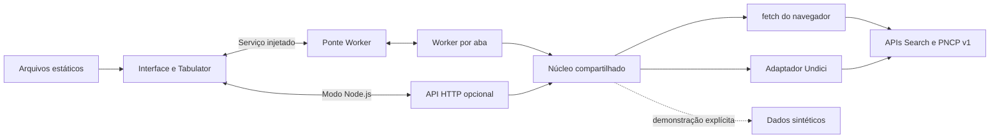

# Arquitetura e organização do código

O Compras Web tem duas distribuições que compartilham regras de negócio e interface. Na distribuição estática, um Web Worker por aba valida entradas, consulta o PNCP e gera CSV. Na distribuição Node.js, o servidor entrega a interface e mantém a API HTTP. Somente o adaptador Node.js depende de Undici, ambiente do processo e buffers de Node.

## Componentes

| Arquivo | Responsabilidade |
| --- | --- |
| [`src/settings.js`](../src/settings.js) | Padrões e validação de configuração portável; whitelist pública |
| [`src/operation.js`](../src/operation.js) | Operações, cancelamento, prazo absoluto e contadores de recursos |
| [`src/validation.js`](../src/validation.js) | Consultas, filtros, domínios, sugestões, identidades e paginação; valida antes da rede nos dois modos |
| [`src/schema.js`](../src/schema.js), catálogo JSON e [`src/filter-domains.js`](../src/filter-domains.js) | Colunas, 80 filtros, compatibilidade documental, domínios e apresentação |
| [`src/pncp-core.js`](../src/pncp-core.js) | Serialização, fila, ritmo, tentativas, leitura incremental, normalização e caminhos PNCP |
| [`src/query-core.js`](../src/query-core.js) | Pesquisa, validação de domínios, metadados, detalhes e coleta por páginas |
| [`src/csv.js`](../src/csv.js) | Codificação UTF-8 com BOM, CRLF, escape e orçamento por byte |
| [`src/adapter.js`](../src/adapter.js), [`src/related.js`](../src/related.js), [`src/document-details.js`](../src/document-details.js) | Projeções, precisão, identidades e links seguros para os três tipos e registros filhos |
| [`src/browser/client.js`](../src/browser/client.js) | Configuração pública e transporte fetch nativo sem credenciais |
| [`src/browser/runtime.js`](../src/browser/runtime.js), [`worker.js`](../src/browser/worker.js) | Serviço no Worker, métodos permitidos, operações, progresso, erros serializados e buffers transferíveis |
| [`src/browser/service.js`](../src/browser/service.js), [`protocol.js`](../src/browser/protocol.js) | Ponte por ID, versão, cancelamento local, descarte de respostas tardias e recuperação de falha |
| [`public/app.js`](../public/app.js) | Interface compartilhada inicializada com um serviço injetado; DOM, Tabulator, painéis e download |
| [`public/browser-entry.js`](../public/browser-entry.js) | Bibliotecas locais, configuração pública e inicialização da distribuição estática |
| [`public/node-entry.js`](../public/node-entry.js), [`http-service.js`](../public/http-service.js) | Inicialização Node.js e adaptação da API HTTP ao mesmo contrato de interface |
| [`src/server.js`](../src/server.js), [`config.js`](../src/config.js), [`pncp.js`](../src/pncp.js), [`query.js`](../src/query.js) | Adaptadores Node.js: rotas/arquivos, ambiente/proxy, Undici e compatibilidade do CSV/metadata |
| [`src/demo.js`](../src/demo.js) | Fonte fictícia escolhida explicitamente em ambos os modos |
| [`vite.config.js`](../vite.config.js) | Aplicação e diagnóstico, Worker ES module, assets relativos, CSP e saída `dist-browser/` |
| [`scripts/build.js`](../scripts/build.js) | Distribuição Node.js em `dist/` por cópia |
| [`test/`](../test/) | Núcleo, API, DOM, runtime/RPC, interface Node e build estático no navegador |

Vite e Playwright são ferramentas de desenvolvimento. Tabulator e `lossless-json` são incluídos nos bundles; não há CDN, imports de pacote pendentes ou polyfills de Node.js em produção estática.

## Serviço e fluxo de dados

A interface usa `service.call(method, payload, {signal, onProgress})`. O adaptador HTTP traduz esse contrato para as rotas existentes. A ponte do navegador confirma a versão e envia `{id, method, payload}` ao Worker. Cada resultado, erro ou progresso pertence ao mesmo ID. O `AbortSignal` permanece na interface e seu evento gera uma mensagem de cancelamento. Dados projetados são objetos simples; decimais e identificadores preservam a representação textual exata.

Os métodos são `schema`, `execute`, `domains`, `suggest`, `details`, `related`, `documentDetails`, `documentRelated`, `contractChild` e `export`. Métodos e campos desconhecidos são rejeitados. Se o Worker falhar, todas as promessas pendentes são rejeitadas; a próxima chamada inicializa um novo Worker. O descarte da página encerra o Worker. Fechar um painel cancela suas operações sem encerrar as demais.

A primeira pesquisa configura esquema, colunas e filtros, valida capacidades e domínios fechados e consulta a fonte. Cada troca de página faz nova chamada. A fila compartilha concorrência e ritmo entre pesquisa, domínios, painéis e CSV. O leitor confere bytes antes de decodificar o corpo com `TextDecoder`, e interpreta JSON com `lossless-json`. A pesquisa confere tipo documental, total e quantidade de registros antes da projeção.

Critérios novos começam na primeira página; Atualizar preserva os últimos critérios concluídos e a página. Respostas antigas são descartadas. Falhas identificam e preservam o resultado anterior e desabilitam exportação até a pesquisa concluir novamente.

## Painéis dos documentos

Contratações iniciam itens, arquivos, atas, contratos/empenhos e histórico em segundo plano. Atas iniciam detalhes completos, partes envolvidas, contratos, arquivos e histórico. Contratos iniciam detalhes completos, empenhos, instrumentos de cobrança, termos, arquivos e histórico. Uma fila do painel limita a duas tarefas ativas; abas preservam dados e paginação, contadores, teclado e recuperação independente.

CNPJ, ano e sequenciais são textos validados. Atas preservam sequenciais da compra e da ata; contratos usam seu próprio sequencial. O detalhe completo confere controle PNCP contra a identidade antes de substituir os campos da busca. Falhas conservam os campos disponíveis.

Itens, arquivos, histórico e termos usam contagens separadas; outros recursos usam o total de envelopes paginados. Instrumentos de cobrança chegam numa lista sem paginação e usam `pagination_source: local_slice`. Arquivos de termos e detalhes de empenhos/instrumentos são consultados sob demanda. Arquivos binários permanecem como links seguros da fonte, sem coleta ao abrir o painel.

HTTP 404 significa zero somente em contratos vinculados a uma contratação. Outros 404 continuam sendo erro. Listagens que admitem 204 preservam sua semântica, conferindo contagens quando disponíveis; a busca não converte 204 em vazio. Falha de transporte sem HTTP legível nunca vira zero.

## CSV e recursos

Exportar inicia uma nova coleta com os últimos critérios concluídos. Cada página confere total, tamanho e identidade; duplicação ou alteração encerra a operação. O Worker projeta uma página e codifica lotes de 25 documentos, devolvendo controle ao loop de eventos entre lotes/páginas. Mantém chunks de bytes e um conjunto de identidades, sem acumular todos os documentos.

Progresso contém páginas, linhas, total e bytes. Só a coleta completa transfere os `ArrayBuffer` à interface, junto de nome, MIME e metadados compactos. A interface cria o Blob e revoga a URL após o download. Não há download parcial. `snapshot_guaranteed` permanece `false`, pois o PNCP pode mudar entre chamadas.

O adaptador Node.js usa a mesma coleta e codificação, mas mantém `metadata.data` e concatena buffers para compatibilidade com a API e benchmark. Seus limites pertencem ao processo; os do navegador pertencem a cada Worker/aba. Padrões, timeouts e limitações de exportação estão em [Configuração](configuracao.md).

## Persistência e segurança

Estado, fila, contadores e respostas são transitórios. Não há banco de dados, login, cache persistente, Service Worker, consultas reais offline ou coordenação entre abas. A demonstração é identificada e nunca substitui automaticamente falhas reais.

A configuração estática só aceita chaves públicas e bases fixas do PNCP. Consultas nativas são GET com CORS, sem credenciais/cache e sem seguir redirecionamentos. TLS e CORS são controles do navegador e da fonte; a aplicação não os contorna. A CSP permite conexões PNCP e Worker da própria origem. Textos da fonte são exibidos como texto, e links são validados.

O artefato usa assets com hash e caminhos relativos para raiz/subdiretório. Cabeçalhos, atualização, diagnóstico na origem publicada e retorno à distribuição Node.js estão em [Hospedagem estática](hospedagem-estatica.md). Os testes e seu alcance estão em [Validação](validacao.md).
