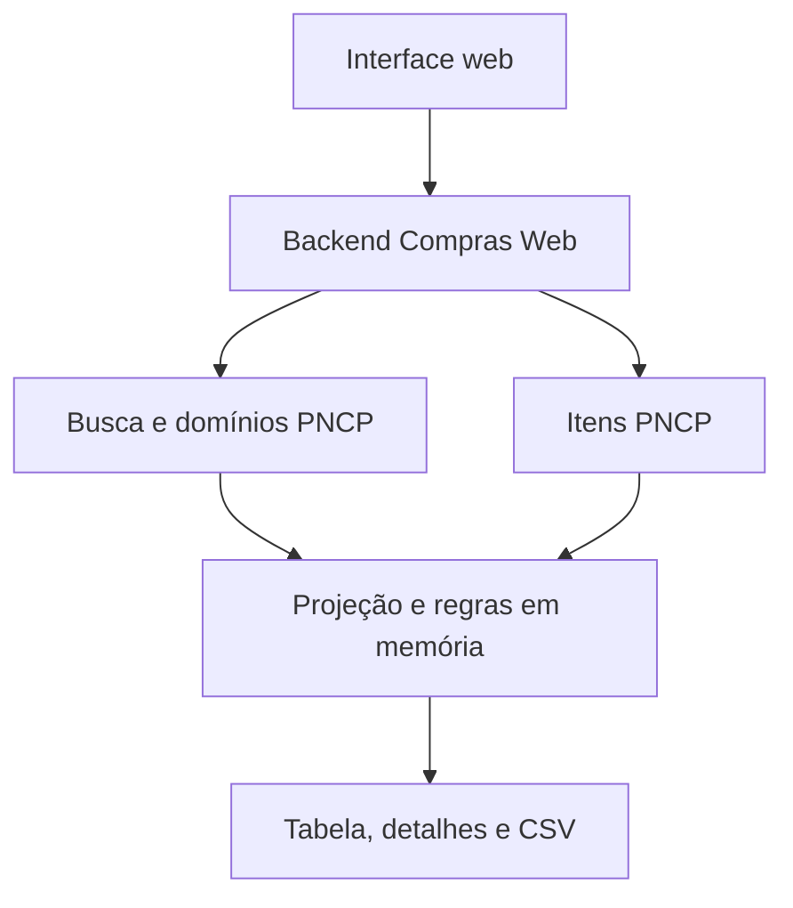

> Referência histórica. Desde 06/10/2026, a aplicação usa somente consultas diretas ao PNCP; consultas prontas e refinamento local foram removidos. O comportamento atual está em [consultas-pncp.md](consultas-pncp.md).

# Compras Web — especificação funcional e técnica com consulta ao PNCP

**Versão:** 2.0.0  
**Data:** 1 de outubro de 2026  
**Fonte dos dados:** APIs públicas do Portal Nacional de Contratações Públicas (PNCP).  
**Estado:** especificação da arquitetura a implementar; esta revisão documental não significa que o aplicativo já foi migrado.

Esta versão substitui o armazenamento local, a importação de CSVs e a preparação de índices por consultas ao PNCP durante o uso do aplicativo. A pesquisa principal utiliza `https://pncp.gov.br/api/search/`. Quando uma regra exige informações que não existem no resumo da busca, o backend consulta os serviços de detalhes do próprio PNCP.

A documentação foi revisada a partir de `documentacao-compras-web(2).md` e `Documentacao_API_Search_PNCP(2).md`. O catálogo de 87 argumentos da busca consta no Anexo C. Esse catálogo foi identificado no frontend público do PNCP: não é uma especificação oficial e exaustivamente homologada do backend. Os serviços de itens têm documentação oficial própria, indicada na seção 16.

## 1. Escopo do produto e mudanças de versão

O Compras Web permite pesquisar contratações públicas, aplicar consultas prontas e filtros, examinar registros e exportar resultados. A interface continua baseada em tabela, com detalhes, seleção de colunas e categorias calculadas pelo aplicativo.

| Assunto | Comportamento exigido na versão 2 |
| --- | --- |
| Fonte de verdade | PNCP, consultado por HTTP durante cada operação |
| Banco de dados | Nenhum banco local ou réplica persistente de contratações |
| Importação | Eliminada, incluindo importação inicial e incremental |
| Download de bases | Eliminados downloads anuais de compras/itens e sincronizações em lote |
| Atualização | Nova consulta, mudança de página, abertura de detalhes, atualização ou exportação obtêm dados pela API |
| Índice e cache persistente | Eliminados SQLite, FTS e arquivos de resultados reutilizáveis |
| Memória | Somente dados transitórios necessários à operação em andamento e à apresentação da resposta |
| Unidade da tabela | Uma contratação por linha; itens aparecem nos detalhes e na verificação de regras |
| Funcionamento sem rede | Somente a interface e a demonstração; dados reais exigem acesso ao PNCP |
| Exportação | CSV dos resultados que puderem ser consultados integralmente dentro dos limites declarados |

Os nove presets e as dezoito categorias são preservados como regras de negócio, com adaptações explícitas à estrutura da API. Filtros por qualquer coluna, expressões regulares, deduplicação por objeto e ordenações locais exigem uma consulta delimitada, conforme a seção 5. Não se presume que a API remota ofereça todos os operadores da antiga consulta SQL.

O escopo principal continua sendo **contratações**, representadas por `tipos_documento=edital`. Atas, contratos, PCA e IRP são tipos reconhecidos pelo adaptador, mas os nove presets e a consulta dos itens descrita aqui são exclusivos de `edital`. A interface só deve habilitar outro tipo quando houver projeção, colunas e capacidades correspondentes implementadas e verificadas.

### 1.1 Significado de tempo real

Cada operação consulta a resposta disponível no PNCP naquele momento. Isso não implica atualização contínua por push, ausência de atraso de indexação no PNCP nem uma visão transacional congelada entre páginas.

Não armazenar respostas de negócio em SQLite, outro banco, arquivos de cache, IndexedDB, localStorage ou service worker. Preferências visuais podem ser persistidas sem resultados de contratações. A tabela pode manter a última resposta já exibida, identificada com seu horário, mas ela não será usada para responder a uma nova consulta nem como fallback silencioso quando o PNCP falhar.

O botão **Atualizar resultados** repete a consulta completa. Respostas locais com dados devem usar `Cache-Control: no-store`; requisições ao PNCP devem solicitar revalidação quando aplicável. O aplicativo não controla os caches ou a atualização interna do PNCP.

## 2. Arquitetura e responsabilidades

Manter um backend intermediário entre o navegador e o PNCP. Ele concentra validação, construção de URLs, limites de requisições, tratamento de falhas, projeção dos registros, presets e CSV. O navegador não depende de CORS da API pública nem recebe uma URL arbitrária para o servidor acessar.

| Componente proposto | Responsabilidade |
| --- | --- |
| Interface web | Pesquisa, filtros, tabela, horário de consulta, detalhes e exportação |
| API do Compras Web | Contratos JSON, validação estrita, erros e cancelamento da operação |
| Cliente PNCP | HTTPS, serialização de parâmetros, timeouts, tentativas e paginação |
| Registro de capacidades | Argumentos conhecidos, domínios, tipos de documento e ordenações habilitadas |
| Adaptador de documentos | Projeção do JSON de busca em campos estáveis para a interface |
| Adaptador de itens | Leitura sob demanda dos itens de uma contratação |
| Serviço de regras | Presets, refinamento em memória, categorias e agrupamento opcional |
| Serviço de exportação | Nova consulta remota e geração de CSV, sem manter uma base de dados |



O fluxo normal consulta uma página da busca e devolve sua projeção. O fluxo refinado consulta um conjunto pequeno e delimitado de candidatos, obtém os detalhes necessários, aplica as regras e só então ordena e pagina. Toda essa coleta pertence à mesma operação; seu resultado não é um índice reutilizável.

Não criar rotina de sincronização, carga inicial, migração de dados, preparação de pesquisa ou agendamento de importações. Preferir um processo servidor com controle de concorrência em memória. Uma implantação com vários processos precisa dividir o limite global de chamadas ao PNCP; aumentar workers não deve multiplicar esse limite sem controle.

## 3. Modelo de dados e projeção

### 3.1 Documentos da busca

O retorno usual de `/api/search/` é um objeto com `items` e `total`. Cada elemento de `items` representa um documento do portal, e não um item licitado. Portanto, não reproduzir a antiga junção de CSVs de compras e itens, nem criar linhas artificiais para cada item na tabela principal.

Preservar o registro original em memória durante a operação para a tela de detalhes. A projeção estável usa os campos abaixo, quando presentes. Os aliases de compatibilidade existem apenas na API do aplicativo; não são argumentos do PNCP.

| Campo do aplicativo | Origem em `items[]` | Observação |
| --- | --- | --- |
| `id` | `id` | Identificador retornado pelo índice; manter como texto |
| `tipo_documento` | `doc_type` | Mapeamento original; a integração real usa `document_type`, conforme [errata de 02/10/2026](correcao-validacao-pncp.md). Não confundir com instrumento convocatório |
| `numero_controle_pncp` | `numero_controle_pncp` | Identificador de negócio, quando disponível |
| `objeto_compra` | `description` | Descrição resumida do documento; não substituir por `title` silenciosamente |
| `titulo` | `title` | Título da publicação |
| `orgao_cnpj` | `orgao_cnpj` | CNPJ é diferente de `orgao_id` |
| `orgao_nome` | `orgao_nome` | Nome do órgão |
| `unidade_orgao_nome_unidade` | `unidade_nome` | Alias para o título já utilizado na interface |
| `unidade_orgao_codigo_unidade` | `unidade_codigo` | Não usar esse código em `unidades` |
| `orgao_entidade_esfera_id` | `esfera_id` | Esfera administrativa |
| `orgao_entidade_poder_id` | `poder_id` | Poder |
| `uf` / `municipio_nome` | `uf` / `municipio_nome` | Localização |
| `modalidade_nome` | `modalidade_licitacao_nome` | Modalidade da contratação |
| `situacao_compra_nome_pncp` | `situacao_nome` | Situação administrativa |
| `data_publicacao_pncp` | `data_publicacao_pncp` | Data da publicação na fonte |
| `data_atualizacao_pncp` | `data_atualizacao_pncp` | Atualização informada pelo PNCP |
| `valor_total_estimado` | `valor_total_estimado` | Valor da contratação, quando disponível |
| `valor_total_homologado` | `valor_total_homologado` | Valor homologado, quando disponível |
| `tem_resultado` | `tem_resultado` | Indicador do documento, não de um item selecionado |
| `link_sistema_origem` | `link_sistema_origem` | Link externo validado |
| `url_pncp` | `item_url` | Resolver caminhos relativos contra `https://pncp.gov.br/app` |
| `categorizacao` | Cálculo do aplicativo | Regras da seção 6.4 |

Para construir `url_pncp`, um caminho como `/editais/...` deve produzir `https://pncp.gov.br/app/editais/...`; evitar o comportamento de uma resolução genérica que remova `/app`. Validar esquema e origem antes de transformar o campo em link. Se o caminho não for reconhecido, oferecer o link geral do portal em vez de inventar um endereço de detalhe.

Nota de integração de 02/10/2026: a resposta real também usa `/compras/{cnpj}/{ano}/{sequencial}`; na implementação 2.0.3, esse caminho é convertido para `https://pncp.gov.br/app/editais/...`, conforme a rota do portal indicada pelo usuário. As diferenças de domínio de anos e de situação de itens estão documentadas na [auditoria de integração](auditoria-integracao-pncp.md).

Campos ausentes, `null`, texto vazio, `false`, zero, arrays e objetos não são intercambiáveis. Não aplicar os antigos marcadores de ausência de CSV: textos como `NA`, `NULL` ou `None` permanecem textos se vierem assim no JSON. Campos extras podem aparecer nos detalhes, mas só entram em filtros e colunas após registro no esquema.

Identificadores e códigos permanecem strings. Valores monetários e quantidades devem ser tratados com representação decimal adequada; o contrato local usa strings decimais para valores projetados, evitando perda de precisão no navegador. Datas permanecem strings ISO na API local, com formatação visual separada. Não assumir timezone para valores que não tragam essa informação.

### 3.2 Itens consultados sob demanda

Para contratações, utilizar o serviço documentado oficialmente:

```text
GET https://pncp.gov.br/api/pncp/v1/orgaos/{cnpj}/compras/{ano}/{sequencial}/itens
    ?pagina=1&tamanhoPagina=100
```

Os parâmetros de paginação desse serviço são `pagina` e `tamanhoPagina`, diferentes de `tam_pagina` da busca. O adaptador deve verificar o formato real de resposta, o tamanho efetivamente atendido e a condição de fim de paginação; a operação não pode considerar somente a primeira página como lista completa. Não declarar fim apenas porque chegaram menos registros que o tamanho solicitado se o serviço puder reduzir esse tamanho. O valor 100 do exemplo é uma escolha do cliente a verificar na integração, não um máximo oficial do endpoint de itens.

Usar a identificação original da contratação: `orgao_cnpj`, `ano` e `numero_sequencial`, quando disponíveis no documento. Se faltar identificação confiável, retornar `DETAILS_UNAVAILABLE`; não substituir CNPJ por ID do órgão nem usar o CNPJ de uma eventual sub-rogação sem validação.

| Campo utilizado | Campo do serviço de itens |
| --- | --- |
| Número do item | `numeroItem` |
| Tipo material/serviço | `materialOuServico` |
| Situação do item | `situacaoCompraItemId` / `situacaoCompraItemNome`; o endpoint real consultado retornou `situacaoCompraItem`, conforme a auditoria de 02/10/2026 |
| Descrição | `descricao` |
| Código do catálogo | `catalogoCodigoItem` |
| Identificação do catálogo | `catalogo.id` / `catalogo.nome` |
| Existência de resultado | `temResultado` |

Fonte deste mapeamento: [Consultar Itens de uma Contratação — manual PNCP](https://pncp.gov.br/manual/pt-br/latest/contratacao/consultar_itens_de_uma_contratacao.html). A presença de um campo no contrato não garante que todo registro tenha valor preenchido.

Não projetar `descricao_resumida`, `material_ou_servico_nome`, `situacao_compra_item_nome`, `cod_item_catalogo` ou `data_resultado` como se fossem campos únicos do resumo da contratação. Esses dados pertencem a itens ou resultados. A interface deve mostrar uma sublista de itens; filtros sobre resultados detalhados só serão habilitados quando o respectivo adaptador estiver implementado.

### 3.3 Identidade, deduplicação e contagens

A identidade de uma contratação combina tipo de documento e número de controle PNCP; na ausência deste, usar o `id` do documento junto ao tipo. Se ambos estiverem ausentes, sinalizar registro sem identidade; não criar identidade com o objeto da compra.

A opção padrão é `deduplicate="none"`. Contratações diferentes podem ter o mesmo objeto e devem continuar visíveis. O agrupamento antigo por objeto exato passa a ser uma opção explícita, `deduplicate="objeto_exato"`, disponível somente no modo refinado. Ele ocorre depois dos filtros, conserva a primeira ocorrência na sequência coletada e agrupa também objetos nulos entre si, conforme a regra anterior.

Duplicações técnicas observadas entre páginas de uma coleta devem ser identificadas pela identidade do documento. Não alterar `total` do PNCP para esconder esse problema. A seção 7 define quando uma coleta pode ser considerada completa.

## 4. Integração com a API de busca

### 4.1 Requisição básica

```bash
curl --get 'https://pncp.gov.br/api/search/' \
  --data-urlencode 'tipos_documento=edital' \
  --data-urlencode 'status=todos' \
  --data-urlencode 'q=firewall' \
  --data-urlencode 'ufs=DF|GO' \
  --data-urlencode 'ordenacao=-data' \
  --data-urlencode 'pagina=1' \
  --data-urlencode 'tam_pagina=50'
```

Usar `GET`, sem corpo, com `Accept: application/json`. As consultas públicas examinadas não exigiram token. O Compras Web não solicita credenciais de publicação nem utiliza operações de escrita no PNCP.

Enviar `tipos_documento` e `status` explicitamente. Na pesquisa geral de contratações, usar `edital` e `todos`. Omitir `q` quando vazio. `status` representa o estado temporal; `situacoes` representa a situação administrativa. `status=todos` não significa que revogadas e anuladas foram excluídas.

| Tipo de documento | Valores de `status` utilizados pelo portal |
| --- | --- |
| `edital` | `todos`, `recebendo_proposta`, `propostas_encerradas` |
| `ata`, `contrato` | `todos`, `vigente`, `nao_vigente` |
| `irp` | `todos`, `vigente`, `nao_vigente`; referem-se à manifestação de interesse |
| `pcaorgao` | Sem seletor temporal equivalente; usar a convenção geral `todos` quando habilitado |

O parâmetro remoto aceita listas de tipos separadas por pipe, mas o contrato local inicial trabalha com um único `document_type`, para manter projeção e capacidades coerentes. Uma expansão para consulta de vários tipos exige contrato próprio. Não enviar `tipos_documento=todos` nem `pca`.

### 4.2 Serialização e validação

| Entrada no Compras Web | Envio ao PNCP |
| --- | --- |
| Lista de seleções | Unir com `\|` e aplicar URL encoding uma única vez |
| Booleano | `true` ou `false`; ausência significa não filtrar |
| Decimal | String com ponto decimal, sem moeda nem separador de milhares |
| Data | `AAAA-MM-DD`, validada como data real |
| Órgão, unidade ou fornecedor | ID retornado pelo domínio pertinente; não nome, CNPJ ou código administrativo |
| Município | ID obtido para o tipo de documento; `codigo_ibge` é um filtro distinto |
| Valor vazio opcional | Omitir, sem confundir com `false` ou `0` |

A API local deve rejeitar campos desconhecidos, tipos incorretos, combinações não habilitadas e intervalos invertidos. Não converter automaticamente qualquer valor recebido em texto nem aceitar um booleano como inteiro.

O registro de capacidades deve contemplar os **87 nomes do Anexo C**. Cada entrada informa tipo, cardinalidade, documentos aplicáveis, domínio, evidência e estado `enabled` ou `pending_validation`. Estar no catálogo não significa que todas as combinações tenham sido verificadas. Parâmetros ainda não habilitados retornam erro explícito, sem serem descartados ou enviados como se estivessem homologados.

Os controles `tipos_documento`, `q`, `status`, `ordenacao`, `pagina`, `tam_pagina` e `total` são reservados ao adaptador. O objeto `pncp_filters` só aceita os outros 80 nomes. `total=true` ativa uma forma de agregação do PNCP e não deve ser enviado nas consultas de tabela ou exportação.

### 4.3 Domínios e sugestões

```text
GET https://pncp.gov.br/api/search/filters?tipos_documento=edital
GET https://pncp.gov.br/api/search/suggest?tipos_documento=edital&campo=orgaos&q=saude&tam_pagina=20
```

`/filters` fornece um objeto `filters`; `/suggest` fornece `items`, sem total garantido. Obter as opções durante o uso e com o mesmo tipo de documento da pesquisa. Não reutilizar IDs municipais ou de outros domínios indiscriminadamente entre tipos. Uma lista truncada não é uma enumeração completa: usar sugestões para domínios extensos.

| Chave de domínio em `/filters` | Argumento de busca |
| --- | --- |
| `item_situacoes` | `situacoes_item` |
| `item_tipos` | `tipos_item` |
| `item_categorias_leilao` | `categorias_leilao` |
| `item_beneficios` | `beneficios` |
| `item_unidades_medida` | `unidades_medida` |
| `resultado_item_situacoes` | `situacoes_resultado` |

As sugestões aceitas dependem do tipo e do campo. A interface inicia autocomplete com três caracteres, debounce de 450 ms e limite local de 20 sugestões. Esses valores são escolhas do Compras Web, não limites comprovados do serviço.

### 4.4 Busca textual e ordenação

`q` pesquisa vários campos indexados pelo PNCP. Não é equivalente ao operador `like` aplicado exclusivamente a `objeto_compra`. Aspas e operadores `AND`, `OR` e `NOT` constam dos comportamentos examinados; não usar o prefixo `-` como exclusão sem validação. Não converter expressões regulares Python em `q` automaticamente.

| Contexto | Ordenações identificadas no portal |
| --- | --- |
| Geral | `-data`, `data`, `relevancia` |
| Editais | `numero_controle_pncp`, `-valor_total_estimado` |
| Contratos | `numero_controle_pncp`, `numero_contratacao`, `data_inicio_vigencia`, `valor_global` |
| Atas | `valor`, `-valor` |

No modo nativo, habilitar inicialmente `-data`, `data` e, quando houver texto, `relevancia`, além das opções específicas verificadas para cada tipo. Não inferir que qualquer campo aceite os prefixos `+` ou `-`, que várias ordenações sejam suportadas ou que a direção das opções ainda não ensaiadas esteja confirmada.

O cabeçalho de uma coluna só mostra ordenação remota quando existir mapeamento habilitado. Para outros campos, oferecer ordenação no modo refinado ou informar a indisponibilidade.

## 5. Semântica das consultas

### 5.1 Dois modos explícitos

| Modo | Execução | Uso |
| --- | --- | --- |
| `native` | Uma página consultada diretamente no PNCP, sem pós-filtro que remova linhas | Busca geral e filtros nativos |
| `refined` | Coleta delimitada de candidatos, detalhes necessários, regras em memória e paginação final | Presets, operadores adicionais, categorias como filtro e agrupamento por objeto |

Nunca aplicar um filtro apenas à página recebida e apresentar o total global do PNCP como total filtrado. Também não preencher uma página buscando resultados adicionais sem percorrer e contar o universo delimitado necessário à regra.

O modo refinado é parte da consulta em tempo real. Não gera carga persistente nem conserva candidatos para pesquisas futuras. Por simplicidade e atualização, cada chamada, inclusive troca de página refinada, faz uma nova coleta. A interface informa o custo e recomenda delimitar datas, UF ou órgão.

### 5.2 Filtros nativos

Todos os critérios nativos selecionados pertencem à mesma requisição ao PNCP. Listas são transmitidas conforme o serviço, sem inventar uma álgebra SQL equivalente para todos os campos. Combinações de filtros de item, resultado e fornecedor não provam que os critérios foram satisfeitos pela mesma ocorrência interna da contratação.

O seletor de campos deve distinguir filtros de domínio, intervalos numéricos, intervalos de datas, booleanos e busca textual global. Um filtro de cabeçalho para órgão ou modalidade abre a seleção do domínio correspondente; não envia `nome like ...` como se fosse um argumento nativo.

Não implementar OU entre campos por união improvisada de várias buscas: isso altera total, paginação, janela e multiplicidade. Expressões E/OU adicionais são resolvidas no modo refinado, sobre o conjunto candidato definido pelos filtros nativos explícitos.

### 5.3 Refinamento delimitado

1. Validar a consulta e identificar quais campos e detalhes serão necessários.
2. Consultar a primeira página de candidatos e o total informado pelo PNCP.
3. Se o total exceder `PNCP_MAX_REFINEMENT_CANDIDATES`, interromper com `QUERY_TOO_BROAD`; pedir filtros mais restritivos. Não processar apenas os primeiros candidatos.
4. Coletar todas as páginas desse conjunto, respeitando a janela do serviço e os limites de tempo, chamadas e memória.
5. Projetar os documentos. Buscar itens somente quando exigidos pelas regras ou pelo preset.
6. Aplicar preset, regras adicionais e cabeçalhos; calcular categorias quando necessário.
7. Deduplicar por objeto apenas se solicitado; ordenar e paginar o resultado final.
8. Devolver contagens separadas, horários e critérios efetivamente aplicados; descartar os dados de trabalho ao terminar.

Os candidatos correspondem à consulta nativa explicitamente escolhida pelo usuário e às restrições nativas seguras do preset. Não inserir uma pesquisa `q` aproximada como pré-filtro oculto de uma regra literal ou regex: isso poderia eliminar correspondências antes da verificação.

Se a coleta não alcançar todos os candidatos, um detalhe obrigatório falhar ou um limite operacional for atingido, a consulta falha como incompleta. Não transformar a falha em “nenhum resultado”. Valores realmente ausentes na fonte podem produzir resultado indeterminado de uma regra; informar sua contagem, conforme a seção 6.

### 5.4 Operadores adicionais

As regras sobre campos textuais projetados preservam os operadores da versão anterior. Seja `F(x)` o casefold Unicode; ele não remove acentos. Regex usa semântica de busca, sem ancoragem automática, compatível com Python `IGNORECASE` ou com um subconjunto explicitamente rejeitado quando não suportado.

| Operador | Regra | Valor `null` |
| --- | --- | --- |
| `like` | Contém literalmente `F(valor)` | Falso |
| `not_like` | Não contém literalmente `F(valor)` | Verdadeiro |
| `=` | Igualdade após casefold | Falso |
| `!=` | Diferença após casefold | Verdadeiro |
| `starts` | Começa com o texto literal após casefold | Falso |
| `ends` | Termina com o texto literal após casefold | Falso |
| `regex` | Pesquisa regex no texto original | Falso |
| `empty` | `null` ou string exatamente vazia | Verdadeiro |
| `not_empty` | Qualquer outra string | Falso |

Espaços não equivalem a vazio. Campo não suportado não equivale a campo nulo: rejeitar o primeiro caso. Filtros textuais não se aplicam automaticamente a arrays, objetos, datas ou decimais. Para números e datas, usar intervalos nativos; um operador adicional só será habilitado com semântica tipada documentada.

A expressão final é `preset AND grupo_adicional AND cabeçalhos`. O grupo adicional usa `filter_join=and|or`; todos os cabeçalhos são combinados por AND. Um grupo vazio é verdadeiro. Avaliar filtros antes de agrupar por objeto. Quando uma regra adicional envolver itens, o esquema deve declarar seu escopo; rejeitar campos de item no formulário de documentos até existir avaliação correlacionada no mesmo item.

Regex arbitrária deve ter limite de execução e ser cancelável. Não executar um padrão sem limite na thread que atende toda a aplicação. Timeout ou construção não suportada resulta em erro claro; não em resultado parcial.

### 5.5 Ordenação refinada

Suportar até dez critérios registrados no esquema. Texto usa casefold, decimais usam comparação numérica e datas usam a representação temporal validada. Essa tipagem substitui a antiga ordenação universal como texto; por exemplo, 2 precede 10 numericamente. Valores nulos ficam no fim nos dois sentidos; o desempate conserva a sequência coletada.

Campos sem tipo conhecido não são ordenáveis automaticamente. Sem ordenação adicional, preservar a ordem recebida do PNCP. Ela não é uma promessa de estabilidade entre novas requisições.

## 6. Consultas prontas e categorias

### 6.1 Presets mantidos

| ID | Nome | Modo | Categoriza |
| --- | --- | --- | --- |
| `all` | Todas as contratações | Nativo; refinado se houver regra adicional | Sim |
| `personalizado` | Pesquisa personalizada | Conforme os critérios escolhidos | Não |
| `desenvolvimento` | Desenvolvimento | Refinado | Sim |
| `infraestrutura` | Infraestrutura | Refinado | Sim |
| `oracle` | Oracle | Refinado | Não |
| `microsoft` | Microsoft | Refinado | Não |
| `adobe` | Adobe | Refinado | Não |
| `symantec` | Symantec / Broadcom | Refinado | Não |
| `antivirus` | Antivírus e proteção | Refinado | Sim |
| `graebert` | Graebert / CAD | Refinado | Sim |
| `mongodb` | MongoDB | Refinado | Sim |

Todos os nove presets especializados exigem contratação divulgada e a existência de **um mesmo item** de serviço em situação “Em andamento” ou “Homologado”. Desenvolvimento e Infraestrutura acrescentam esfera federal, Pregão Eletrônico e código de catálogo. Os demais acrescentam os padrões textuais do objeto, preservados no Anexo A.

### 6.2 Tradução dos critérios

| Critério de origem | Restrição candidata no PNCP | Verificação final |
| --- | --- | --- |
| Serviço | `tipos_item=S` | Item com `materialOuServico=S` |
| Em andamento ou Homologado | `situacoes_item=1\|2` | Situação do mesmo item em 1 ou 2 |
| Divulgada no PNCP | `situacoes=1` | Situação do documento compatível |
| Esfera federal | `esferas=F` | Esfera do documento |
| Pregão Eletrônico | `modalidades=6` | Modalidade do documento |
| Padrões de objeto | Nenhum `q` automático | Regex sobre `objeto_compra`, como no Anexo A |
| Código do catálogo | Sem argumento direto identificado nos 87 nomes | Código e catálogo no mesmo item de serviço elegível |

Os códigos de domínio acima são os identificados na documentação de referência e devem ser conferidos na integração. Restrições candidatas só podem ser ativadas quando sua aplicação tiver sido verificada; sem essa confirmação, omiti-las da busca de candidatos e manter a verificação final, sujeita ao limite de coleta. Não permitir que a otimização altere o significado da regra.

A nova unidade de saída é uma contratação com ao menos um item elegível. Retornar nos detalhes os números dos itens que justificam a correspondência, quando avaliados. Contar contratações, e não linhas de uma antiga junção.

### 6.3 Catálogo, dados ausentes e compatibilidade

As listas históricas de Desenvolvimento e Infraestrutura contêm códigos como `25852.0`. Na versão 1 esses valores eram padrões regex sobre texto proveniente de CSV. Para a versão 2, a regra de catálogo é **igualdade de código dentro do catálogo correspondente**, não regex numérica parcial.

Na configuração dos presets, retirar somente o sufixo literal `.0` dos códigos históricos compostos por dígitos seguidos desse sufixo. Assim, `25852.0` configura o código `25852`. Não aplicar essa transformação a todos os dados recebidos, não converter códigos em ponto flutuante e não remover zeros à esquerda. A mudança de regex para igualdade é uma alteração intencional da versão 2.

A lista anterior não identifica formalmente o catálogo de origem. Por isso, a implementação deve associá-la a um catálogo oficial verificado antes de habilitar Desenvolvimento e Infraestrutura por código. Não assumir que o mesmo número significa o mesmo serviço em qualquer catálogo. Se a associação não estiver configurada, o preset fica indisponível com `CATALOG_MAPPING_REQUIRED`; seus códigos e sua regra permanecem preservados para essa associação. Não substituir a lista por palavras-chave sem uma decisão de negócio explícita.

Quando o serviço responder com dados válidos, mas sem código, catálogo, situação ou outro campo indispensável, classificar a avaliação como `unknown`. Para um predicado existencial: basta um item que satisfaça tudo para `match`; sem testemunha e com informação insuficiente, o resultado é `unknown`; sem testemunha e com avaliação completa negativa, é `no_match`. Regras de documento definitivamente falsas encerram a avaliação como `no_match`.

Resultados `unknown` ficam fora das correspondências confirmadas e são contados em `unverifiable_documents`. A interface e a exportação devem informar a exclusão; `complete_for_rule=false` impede o rótulo “todos os resultados da regra”. Falha HTTP ao buscar um detalhe é erro de coleta, e não dado ausente. Não fabricar códigos a partir da descrição do item.

Preservar os padrões textuais, espaços e grafias do Anexo A, incluindo MySQL no preset Oracle e `crowndstrike` no de antivírus. Eventuais correções de negócio devem ter outra revisão, sem serem misturadas a esta troca de fonte.

### 6.4 Categorização

As dezoito listas do Anexo B permanecem intactas. Categorizar apenas `objeto_compra` da projeção: aplicar lowercase Unicode, normalização NFKD e remoção dos caracteres combinantes. Aplicar a mesma normalização aos termos e escapá-los como literais em uma expressão com fronteiras de palavra Unicode: `\b(?:termo1|termo2|...)\b`.

Retornar todas as categorias encontradas, ordenadas alfabeticamente e concatenadas com `, `. Objeto ausente ou nenhum termo encontrado produz string vazia. Não substituir essa normalização por casefold nem remover acentos dos outros filtros automaticamente.

Na consulta nativa, categorias podem ser calculadas para apresentação na página, pois isso não elimina linhas nem altera o total. Filtrar por categoria exige modo refinado sobre todo o conjunto delimitado. Categoria derivada não é um filtro oficial do PNCP.

## 7. Paginação, limites e consistência

### 7.1 Modo nativo

A janela observada da busca exige `pagina × tam_pagina ≤ 10000`. O PNCP pode informar `total` maior que essa janela. O aplicativo deve distinguir `source_total`, devolvido pela fonte, de `accessible_total`, a parcela paginável.

O Compras Web adota tamanhos de página **10, 25, 50 ou 100**, padrão 50. São limites do produto, não um máximo comprovado do PNCP. Esses tamanhos dividem 10000 e evitam ambiguidade na última página da janela.

```text
accessible_total = min(source_total, 10000)
last_page = max(1, ceil(accessible_total / size))
last_row = accessible_total
total = source_total
```

Desabilitar navegação além de `last_page`. Se `source_total>10000`, mostrar “Refine a pesquisa para acessar todos os resultados”. Não usar `source_total` como última linha acessível. Uma página além do intervalo válido retorna `PAGE_OUT_OF_RANGE` com a última página conhecida; não mudar o número da página silenciosamente.

### 7.2 Modo refinado

`source_total` é o total de candidatos da consulta nativa. `matched_documents` conta correspondências confirmadas antes do agrupamento por objeto; `total` e `last_row` contam as linhas depois desse agrupamento. `unverifiable_documents` conta candidatos que não puderam ser classificados por ausência de informação necessária. A paginação incide somente sobre o resultado final.

```text
last_page = max(1, ceil(total / size))
accessible_total = total
last_row = total
```

`matched_items` deixa de existir como contagem geral, pois a tabela não tem mais granularidade de item. Não reutilizar esse nome para contar documentos.

### 7.3 Dados que mudam durante a coleta

Registrar `started_at` e `finished_at` em UTC para cada operação. `data_atualizacao_pncp` continua sendo o horário informado pela fonte, diferente do horário em que o aplicativo a consultou.

Em coletas de várias páginas, verificar mudanças no total, páginas inesperadamente vazias, identidades repetidas e quantidade final de documentos únicos. Diante de inconsistência detectável, interromper com `SOURCE_CHANGED` e oferecer repetir. Um total estável não prova que o conteúdo permaneceu imutável; o resultado deve sempre declarar `snapshot_guaranteed=false`.

`collection_complete=true` significa apenas que todas as páginas exigidas da consulta delimitada foram obtidas e conferidas segundo o protocolo disponível. Não garante fotografia atômica do PNCP. No modo nativo paginado, usar `collection_complete=false`, mesmo que a página isolada tenha sido recebida corretamente.

Não contornar automaticamente a janela de 10000 dividindo buscas e afirmando cobertura global sem um protocolo próprio de particionamento, deduplicação e verificação. Esse mecanismo não faz parte desta versão.

## 8. Contratos HTTP do Compras Web

Os contratos abaixo são da versão 2 a implementar. Eles substituem os payloads anteriores ligados a banco, importação, índice e geração persistente. Não são descritos como rotas já existentes no código.

### 8.1 Rotas

| Método e rota local | Finalidade |
| --- | --- |
| `GET /` | Interface de consultas |
| `GET /api/schema` | Versão, colunas, presets, capacidades e limites |
| `GET /api/pncp/filters` | Domínios do tipo habilitado; aceitar `tipos_documento` e `normativos_base` |
| `GET /api/pncp/suggest` | Autocomplete; aceitar `tipos_documento`, `campo`, `q` e `tam_pagina` |
| `POST /api/query` | Executar consulta nativa ou refinada |
| `GET /api/contratacoes/{cnpj}/{ano}/{sequencial}/itens` | Itens obtidos do PNCP, com paginação validada |
| `POST /api/export` | Nova consulta dos mesmos critérios e geração de CSV |
| `GET /api/health` | Estado do processo e horário/resultado da última chamada ao PNCP, sem alegar disponibilidade contínua |

Remover `/imports`, seus assets e todas as rotas `/api/imports/*`. Durante uma transição, essas URLs podem devolver 410 com mensagem de que os dados são consultados no PNCP; depois, 404. Nenhuma delas deve criar banco, iniciar tarefas ou redirecionar para uma importação implícita.

`/api/schema` deve funcionar mesmo quando o PNCP estiver indisponível. Ele usa a definição do produto e distingue capacidades configuradas de domínios obtidos naquele momento. Devolve `source="pncp"`, `api_version="2.0"`, `live=true`, colunas tipadas, modos de filtro e ordenação, presets com `available` e `reason`, e limites. Remover `database`, `search_ready`, metadados de fontes e tempos de indexação.

### 8.2 Consulta nativa

```json
{
  "api_version": "2.0",
  "mode": "native",
  "preset": "all",
  "document_type": "edital",
  "q": "firewall",
  "status": "todos",
  "pncp_filters": {
    "ufs": ["DF", "GO"],
    "modalidades": ["6"],
    "valor_total_estimado_min": "100000.00"
  },
  "order": "-data",
  "filters": [],
  "filter_join": "and",
  "header_filters": [],
  "deduplicate": "none",
  "sorters": [],
  "page": 1,
  "size": 50
}
```

Mapear `document_type→tipos_documento`, `order→ordenacao`, `page→pagina` e `size→tam_pagina`. Serializar `pncp_filters` pelo registro de capacidades. Em `native`, `filters`, `header_filters` e `sorters` devem estar vazios e `deduplicate` deve ser `none`; caso contrário, retornar `REFINEMENT_REQUIRED`.

Os filtros adicionais usam `{field,type,value}` e os ordenadores refinados usam `{field,dir}`. Tipos e operações permitidos vêm de `/api/schema`. Nenhum campo de controle pode reaparecer em `pncp_filters`.

### 8.3 Consulta refinada

```json
{
  "api_version": "2.0",
  "mode": "refined",
  "preset": "oracle",
  "document_type": "edital",
  "status": "todos",
  "pncp_filters": {
    "ufs": ["DF"],
    "data_publicacao_inicio": "2026-09-01",
    "data_publicacao_fim": "2026-09-07"
  },
  "order": "-data",
  "filters": [],
  "filter_join": "and",
  "header_filters": [],
  "deduplicate": "none",
  "sorters": [],
  "page": 1,
  "size": 50
}
```

O intervalo acima ilustra o contrato, sem afirmar que caiba no limite ou tenha resultados. O backend aplica as condições obrigatórias do preset. O usuário não pode sobrescrevê-las por uma chave de mesmo nome: intersectar restrições compatíveis e rejeitar conflitos com `PRESET_FILTER_CONFLICT`. Exibir `effective_filters` na resposta para que a consulta seja auditável.

### 8.4 Resposta de consulta

Campos obrigatórios:

| Campo | Tipo / significado |
| --- | --- |
| `api_version`, `source`, `mode`, `request_id` | Identificação do contrato, fonte e operação |
| `data` | Array de documentos projetados |
| `page`, `size`, `last_page`, `last_row` | Paginação conforme a seção 7 |
| `source_total` | Total informado pelo PNCP para a seleção nativa |
| `accessible_total` | Total acessível pela paginação deste modo |
| `matched_documents` | Inteiro no refinado; `null` no nativo |
| `total` | Total da fonte no nativo; linhas finais no refinado |
| `unverifiable_documents` | Inteiro no refinado; `null` quando não houve verificação |
| `window_limited` | Se o total remoto ultrapassa a janela acessível |
| `collection_complete` | Se a coleta exigida foi concluída e conferida |
| `complete_for_rule` | Booleano no refinado; `null` no nativo |
| `snapshot_guaranteed` | Sempre `false` para leituras multipágina sem garantia da fonte |
| `started_at`, `finished_at` | Horários UTC da operação |
| `elapsed_ms`, `upstream_requests` | Duração e número de chamadas remotas |
| `effective_filters` | Critérios efetivamente aplicados, sem credenciais |
| `warnings` | Array de avisos com código e mensagem |

Exemplo estrutural de uma busca nativa vazia, com valores fictícios:

```json
{
  "api_version": "2.0",
  "source": "pncp",
  "mode": "native",
  "request_id": "exemplo-001",
  "data": [],
  "page": 1,
  "size": 50,
  "last_page": 1,
  "last_row": 0,
  "source_total": 0,
  "accessible_total": 0,
  "matched_documents": null,
  "total": 0,
  "unverifiable_documents": null,
  "window_limited": false,
  "collection_complete": false,
  "complete_for_rule": null,
  "snapshot_guaranteed": false,
  "started_at": "2026-10-01T12:00:00Z",
  "finished_at": "2026-10-01T12:00:01Z",
  "elapsed_ms": 1000,
  "upstream_requests": 1,
  "effective_filters": {"tipos_documento": "edital", "status": "todos"},
  "warnings": []
}
```

### 8.5 Validação e erros

Limites locais: corpo máximo de 256 KiB; 60 regras no total entre `filters` e `header_filters`; valor textual de regra até 8192 caracteres; até dez sorters; `page` inteiro positivo; `size` na lista da seção 7. O limite inicial de `q` é 128 caracteres, alinhado ao formulário observado do portal, sem afirmar que seja o limite do backend do PNCP.

Retornar erro estruturado, por exemplo:

```json
{
  "error": {
    "code": "QUERY_TOO_BROAD",
    "message": "Refine datas, órgão ou UF para verificar todos os candidatos.",
    "request_id": "exemplo-002",
    "retryable": false,
    "details": {"source_total": 1200, "limit": 500}
  }
}
```

| HTTP local | Situação |
| --- | --- |
| 400 | Payload, tipo, argumento, operador, domínio ou ordenação inválidos; versão incompatível |
| 409 | `SOURCE_CHANGED`, conflito com preset ou capacidade/configuração ainda indisponível |
| 413 | Corpo acima do limite |
| 422 | `QUERY_TOO_BROAD`, `PAGE_OUT_OF_RANGE`, `REFINEMENT_REQUIRED`, exportação incompleta |
| 429 | Limite local de concorrência; informar `Retry-After` quando conhecido |
| 502 | Resposta inválida, HTML inesperado, JSON incompatível ou erro de integração com o PNCP |
| 503 | PNCP indisponível ou limitando requisições; informar origem e possibilidade de repetição |
| 504 | Tempo de espera ou orçamento total da operação esgotado |

Não tratar HTTP 204 da busca como lista vazia automaticamente: houve respostas sem conteúdo em cenários de parâmetros inválidos no levantamento. Validar o protocolo do endpoint específico. Uma resposta 200 também exige validação de esquema e não prova que um filtro desconhecido foi aplicado.

## 9. Exportação de resultados

`POST /api/export` recebe `{query, scope}`, onde `query` é o contrato da consulta e `scope` é `all` por padrão ou `confirmed_only` no refinado. Ignorar `page` e `size` como recorte do CSV; eles não autorizam exportar somente a página visível. A seleção de colunas da tabela afeta apenas a visualização: exportar todas as colunas documentais registradas, em ordem estável, incluindo categorias quando aplicáveis.

A exportação executa **uma nova consulta ao PNCP** com os critérios da última pesquisa concluída. Pode diferir da tabela por atualizações ocorridas na fonte. Mostrar essa condição junto ao botão e informar o intervalo da coleta no retorno. Não prometer o snapshot da pesquisa anterior.

Procedimento:

1. Validar critérios, capacidade de exportação e limite aplicável.
2. No modo nativo, obter todas as páginas somente se o total couber na janela de 10000 e em `PNCP_MAX_EXPORT_DOCUMENTS`.
3. No modo refinado, repetir a coleta e as regras completas dentro do limite de candidatos.
4. Interromper se faltar página, detalhe obrigatório ou se houver inconsistência detectada; nunca devolver um CSV parcial com nome de exportação completa.
5. Se houver registros `unknown`, `scope=all` retorna `INCOMPLETE_RULE_COVERAGE`. `scope=confirmed_only` é uma ação explícita da interface e exporta apenas correspondências confirmadas, com a contagem excluída informada.
6. Gerar o arquivo após validar a conclusão da coleta. Manter um buffer limitado em memória; se ultrapassar o limite de bytes, falhar antes de iniciar o download. Não criar um repositório persistente de resultados.

CSV: UTF-8 com BOM, vírgula, aspas duplas e escape de aspas/quebras conforme o formato CSV. Nulos tornam-se células vazias; arrays e objetos, quando uma coluna registrada os permitir, usam JSON compacto. Decimais usam ponto, sem formatação monetária; a exportação é voltada à interoperabilidade de dados, não a fórmulas de planilha.

Resposta de sucesso: `Content-Type: text/csv; charset=utf-8`, `Content-Disposition` com nome `compras-pncp-AAAAMMDDTHHMMSSZ.csv` e `Cache-Control: no-store`. Incluir metadados nos cabeçalhos `X-PNCP-Started-At`, `X-PNCP-Finished-At`, `X-PNCP-Source-Total`, `X-Exported-Rows`, `X-Unverifiable-Documents` e `X-Snapshot-Guaranteed: false`. A interface apresenta contagens e horários ao concluir.

Os endpoints nativos `/api/search/export` e `/api/search/export/contratacoes` existem no levantamento, mas não substituem automaticamente este contrato: campos, categorias, refinamento e limites podem divergir. O limite de 2000 mostrado na exportação do portal é uma regra de interface observada, não uma garantia geral do backend.

## 10. Interface e comportamento do cliente

### 10.1 Página principal

Remover o botão **Importar dados**, a página de importação, pastas de origem/destino, seleção de arquivos anuais, preparação de índice e indicadores de banco. O cabeçalho passa a conter pesquisa, filtros, **Atualizar resultados** e **Exportar CSV**.

A tabela deve ocupar a maior parte da janela. Os painéis de consultas e filtros se abrem sobre ela e fecham por botão, Esc ou clique fora. Preservar acessibilidade, seleção de colunas e boa navegação em telas estreitas.

| Configuração | Versão 2 |
| --- | --- |
| Tabela | Tabulator já adotado no projeto, mantendo sua licença na distribuição |
| Paginação | Remota em relação ao backend, inclusive no modo refinado |
| Tamanho inicial / opções | 50 / 10, 25, 50, 100 |
| Layout | `fitDataFill`, altura 100%, colunas móveis |
| Nomes com pontos | `nestedFieldSeparator=false` se forem campos literais |
| Busca/autocomplete | Debounce de 450 ms e cancelamento de pedido anterior |
| Colunas iniciais | Objeto, órgão/unidade, UF, modalidade, situação da contratação, publicação, valor estimado e categorias |
| Detalhes | Resumo do documento, link PNCP e carregamento automático da primeira página de itens ao abrir a contratação |

A lista de colunas e suas capacidades vem de `/api/schema`. Não usar um input `like` universal em todos os cabeçalhos. Indicar quando um critério exige refinamento e aplicar o modo antes de enviar a consulta.

Ao selecionar um preset, limpar regras adicionais e cabeçalhos, restaurar AND e voltar à página 1. Manter somente parâmetros compatíveis de ordenação; mostrar as regras efetivas e os filtros de delimitação que o usuário precisar informar. Presets indisponíveis ficam desabilitados com a razão concreta, como catálogo ainda não associado, em vez de “coluna não importada”.

A faixa de resultados mostra fonte PNCP, horário da consulta, total pertinente ao modo, limite de janela e avisos de cobertura. Dados nulos aparecem como travessão sem alterar o JSON. Não substituir um campo ausente por zero.

### 10.2 Estados, falhas e concorrência

Estados da página: `idle`, `loading`, `success`, `empty`, `error` e `cancelled`. Consultas refinadas e exportações podem informar a etapa “Consultando detalhes”, sem reaproveitar o antigo painel de importação ou prometer porcentagem quando não houver denominador confiável.

Usar AbortController ou equivalente no cliente e propagar cancelamento ao backend quando possível. Conferir também um número de sequência: uma resposta antiga nunca pode substituir linhas, contagens, avisos ou o payload usado para exportação. Cancelar interrompe chamadas remotas futuras e libera buffers; não há transação nem rollback de banco.

Durante atualização, a tabela anterior pode permanecer com aviso de que está sendo atualizada. Após erro, mostrá-la apenas como resultado anterior, com horário e aviso; desabilitar exportação dessa seleção até nova consulta bem-sucedida. Exibir **Tentar novamente**, mantendo os critérios do formulário.

Abrir detalhes não implica que todos os itens já foram carregados. Mostrar paginação própria ou progresso real e o horário dessa consulta. Textos do PNCP entram por `textContent` ou equivalente. Links devem aceitar somente HTTP/HTTPS validado, usando `noopener noreferrer` em nova aba.

## 11. Configuração, desempenho e operação

### 11.1 Configurações propostas

Os valores abaixo são políticas iniciais do aplicativo, ajustáveis após medição; não são limites oficiais atribuídos ao PNCP.

| Configuração | Padrão proposto / finalidade |
| --- | --- |
| `HOST` / `PORT` | `127.0.0.1` / `8000` |
| `PNCP_SEARCH_BASE_URL` | `https://pncp.gov.br/api/search` |
| `PNCP_DETAIL_BASE_URL` | `https://pncp.gov.br/api/pncp/v1` |
| `PNCP_CONNECT_TIMEOUT_SECONDS` | 5 segundos |
| `PNCP_READ_TIMEOUT_SECONDS` | 30 segundos por chamada |
| `PNCP_OPERATION_TIMEOUT_SECONDS` | 120 segundos para coleta completa, incluindo tentativas |
| `PNCP_MAX_RETRIES` | 2 novas tentativas para falhas transitórias |
| `PNCP_MAX_CONCURRENT_REQUESTS` | 2 chamadas simultâneas por processo, com limite global de implantação |
| `PNCP_REQUESTS_PER_SECOND` | 2 chamadas por segundo, reduzidas em caso de limitação |
| `PNCP_PAGE_SIZE` | 50, respeitando os tamanhos suportados |
| `PNCP_MAX_REFINEMENT_CANDIDATES` | 500 contratações; nunca maior que a janela de busca |
| `PNCP_MAX_DETAIL_ITEMS` | 20000 itens por operação; exceder aborta a operação |
| `PNCP_MAX_EXPORT_DOCUMENTS` | 10000 documentos no modo nativo |
| `PNCP_MAX_EXPORT_BYTES` | 50 MiB no buffer final; exceder aborta antes do download |
| `PNCP_MAX_OPERATION_BYTES` | 100 MiB de payloads remotos descomprimidos; limitar também a memória do processo |
| `PNCP_MAX_REQUESTS_PER_OPERATION` | 1000 chamadas, subordinadas ao prazo total |
| `PNCP_PRESET_CATALOG_ID` | Sem padrão; catálogo verificado para os códigos dos dois presets |
| `DEMO_MODE` | `false`; habilita dados sintéticos de teste e marcação visual |

Se uma coleta legítima não couber nos limites operacionais, devolver erro e orientar refinamento; não elevar limites silenciosamente nem reduzir o conjunto sem aviso. No modo refinado, o limite de candidatos prevalece também sobre a exportação.

### 11.2 HTTP e resiliência

Reutilizar conexões HTTPS, manter verificação de certificados e aceitar respostas comprimidas com limite após descompressão. URLs base são configuração do servidor e não entradas livres da API pública do aplicativo. Validar redirecionamentos antes de enviar chamadas a outra origem.

Repetir apenas operações de leitura em falhas de transporte, 429 e falhas transitórias 502/503/504. Usar backoff exponencial com jitter, respeitar `Retry-After` e o prazo total; não repetir 400/404/422 indiscriminadamente. Ao esgotar o orçamento, devolver erro classificado. Não deixar consultas de detalhes ou exportações abrirem concorrência ilimitada.

Medir latência por endpoint, status, número de chamadas, candidatos, documentos confirmados, dados insuficientes e cancelamentos. Logs devem conter metadados operacionais e `request_id`, sem formar um arquivo histórico dos payloads ou uma réplica de contratações.

### 11.3 Inicialização e atualização

A aplicação inicia sem banco, sem pasta de CSV e sem preparação de índice. As páginas e `/api/schema` ficam disponíveis independentemente da rede. A primeira pesquisa realiza a chamada ao PNCP; não dispara download de toda a base.

Exemplo de configuração para uma implementação que preserve a entrada Python `app.py`:

```bash
python -m pip install -r requirements.txt
python app.py --host 127.0.0.1 --port 8000
```

O comando acima é um contrato proposto de execução, não confirmação de que o código antigo já aceite as novas opções. A documentação operacional entregue com a implementação deverá indicar seu comando efetivo.

Eliminar `--db`, `FILTRAGEM_DB`, `--data-dir`, `--cache-dir`, `--prepare-index` e `FILTRAGEM_CHUNKSIZE`. Se essas opções ainda forem recebidas durante a migração, falhar com mensagem de opção descontinuada em vez de abrir uma base antiga.

O modo de demonstração usa respostas JSON sintéticas através de um cliente PNCP substituível, sem SQLite temporário. Exibir “Demonstração — dados fictícios” e não misturar fixtures com respostas reais.

O terminal, se mantido, usa os mesmos adaptadores, limites e presets. Remover ações 98/99 de importação/download e qualquer importação automática antes de pesquisar. Exportar no terminal também é uma consulta online. A entrega pode priorizar somente a web, declarando isso no README.

## 12. Migração da versão anterior

| Elemento anterior | Ação na implementação |
| --- | --- |
| SQLite de origem, tabelas e views | Remover dependência da execução normal |
| `search_index.py`, FTS e caches de consulta em disco | Substituir por cliente PNCP e regras transitórias |
| Importador CSV, downloader anual e `import_service.py` | Remover do fluxo do produto |
| Templates, scripts e estilos de `/imports` | Remover |
| `filtragem_core.py` | Separar somente presets, normalização e categorias ainda aplicáveis |
| `app.py` | Atualizar contratos, fonte remota, erros, detalhes e CSV |
| Campos e total da junção item/compra | Adotar projeção de documento e contagens da seção 7 |
| Deduplicação por objeto ativada por padrão | Tornar opção explícita do modo refinado |
| Ordem textual de números | Substituir por comparação tipada quando houver ordenação refinada |
| Descartes de colunas e marcadores de nulos CSV | Retirar; JSON tem seu próprio contrato |
| Fixtures de importação, DDL e testes de rollback/índice | Substituir por respostas HTTP sintéticas e testes de integração |
| Benchmarks de busca em base local | Retirar como expectativa de desempenho da arquitetura online |
| README e instrução ao agente | Usar exclusivamente o novo fluxo e declarar diferenças |

Não há migração dos dados antigos para outro banco. A aplicação deixa de depender deles. Esta alteração documental também não autoriza apagar automaticamente bancos ou CSVs que o usuário já tenha: limpeza de arquivos legados é uma ação separada.

As regras de domínio e os anexos de presets/categorias permanecem portáveis. Não exigir compatibilidade binária de bancos, pandas, FTS ou arquivos de índice. Remover dependências quando não forem utilizadas por outro componente.

## 13. Aceitação e validação

Esta seção define testes a criar para a implementação. Não afirma que foram executados neste ajuste documental. O antigo pacote de 72 consultas e as fixtures de CSV não são oráculos completos do novo contrato.

Usar um cliente HTTP substituível e fixtures JSON pequenas que reproduzam respostas de busca, domínios, itens, falhas e mudanças entre páginas. Preservar vetores úteis de regex, casefold e categorias, adaptando somente as mudanças declaradas nesta versão.

| ID | Cenário | Resultado exigido |
| --- | --- | --- |
| LIVE-01 | Iniciar sem arquivos de dados e sem banco | Interface e esquema disponíveis |
| LIVE-02 | PNCP muda entre duas pesquisas iguais | Segunda pesquisa faz nova chamada e mostra nova resposta |
| LIVE-03 | PNCP indisponível | Erro visível; nenhum fallback silencioso para base ou cache |
| HTTP-01 | Listas, booleanos e decimais | Pipe, false preservado, ponto decimal e encoding correto |
| HTTP-02 | IDs de órgão/unidade/município | Usar os IDs do domínio pertinente, sem confundir com CNPJ/UASG/IBGE |
| HTTP-03 | Campo desconhecido, status inválido ou capacidade pendente | Rejeição antes da consulta, sem ignorar filtro |
| HTTP-04 | 429, 503, timeout, HTML e 204 inesperado | Tentativas limitadas e erro classificado |
| PAGE-01 | Total acima de 10000 | Limite visível, última página correta e exportação completa recusada |
| PAGE-02 | Zero resultados | Página 1, last_page 1, last_row 0 |
| PAGE-03 | Mudança de total, página vazia inesperada ou duplicação na coleta | `SOURCE_CHANGED`; nenhum resultado integral alegado |
| RULE-01 | Refinamento poderia casar fora da primeira página | Coletar todo o conjunto delimitado antes de filtrar/paginar |
| RULE-02 | Número de candidatos acima do limite | `QUERY_TOO_BROAD`, sem truncamento |
| RULE-03 | Serviço em um item e situação elegível em outro | Preset só casa se um mesmo item satisfizer ambas |
| RULE-04 | Código igual em catálogos diferentes | Não tratar como o mesmo serviço |
| RULE-05 | Catálogo não associado / campo ausente / falha de detalhe | Distinguir indisponibilidade de configuração, unknown e erro HTTP |
| RULE-06 | Filtros, agrupamento e sorters | Filtrar antes de agrupar; contar documentos; ordenar por tipo |
| RULE-07 | Regex inválida ou custosa | Rejeição/timeout sem bloquear todo o servidor |
| CAT-01 | Acentos, fronteiras e vários termos | Reproduzir exatamente as categorias do Anexo B |
| EXP-01 | Exportar consulta paginada | Nova coleta completa dos critérios, sem recorte pela página |
| EXP-02 | Falha na última página ou limite de buffer | Não entregar CSV parcial como completo |
| EXP-03 | Candidatos não verificáveis | `all` recusado; `confirmed_only` explícito e contagem informada |
| UI-01 | Respostas fora de ordem e cancelamento | Somente a consulta mais recente atualiza a tela |
| UI-02 | Uso em celular, detalhes e retomada após falha | Controles acessíveis, horários e mensagens compreensíveis |
| UI-03 | Dados com marcação e links inválidos | Texto exibido sem execução de HTML e links validados |
| OLD-01 | Antigas rotas e opções de importação | Removidas ou descontinuadas; nenhum efeito de carga |
| MEM-01 | Nova consulta, cancelamento e reinício | Buffers liberados; resultados anteriores não viram fonte de dados |

A validação com PNCP real deve usar poucos exemplos por recurso e confirmar seu efeito, não apenas HTTP 200. Registrar data, request sem credenciais, formato recebido e diferenças. Não fixar totais de dados reais em testes, pois mudam com o tempo. Habilitar capacidades conforme forem verificadas e manter a razão das pendências em `/api/schema`.

Critério de conclusão: a aplicação consulta online sem banco/importação; documenta os recursos pendentes; mantém presets e categorias com as adaptações declaradas; trata limites e falhas sem resultados enganosos; e entrega relatórios dos testes efetivamente executados. Medir latência, volume de chamadas e memória em pesquisas nativas, refinadas e exportações separadamente.

## 14. Roteiro de implementação

1. Criar cliente PNCP, registro dos 87 argumentos, validação, domínios e fixtures HTTP.
2. Implementar consulta nativa de editais, projeção e limites de paginação.
3. Atualizar tabela, filtros nativos, detalhes e horário de consulta; retirar importação da interface.
4. Implementar coleta refinada limitada, cancelamento e operadores tipados.
5. Integrar itens; verificar os critérios comuns dos presets e a associação de catálogo dos dois presets por código.
6. Reutilizar termos de objeto e categorias dos anexos, testando a semântica e as contagens.
7. Implementar exportação pela nova coleta e verificar falhas no meio/fim do processo.
8. Retirar dependências de banco, importação e índices; atualizar configuração, demonstração e eventual terminal.
9. Executar os critérios de aceitação, conferir os recursos com a fonte e registrar capacidades pendentes.
10. Entregar instruções operacionais e relatório das mudanças de comportamento, sem afirmar compatibilidade total com a antiga junção de CSVs.

Pseudointerfaces sugeridas:

```text
PncpSearch.search(criteria, page, size, cancellation) -> SourcePage
PncpDomains.filters(type, normatives) -> FilterDomains
PncpDomains.suggest(type, field, text, limit) -> Suggestions
PncpItems.list(identity, page, size, cancellation) -> ItemPage
DocumentAdapter.project(raw) -> Document
QueryService.execute(request, cancellation) -> QueryResponse
Refiner.evaluate(candidates, rules, cancellation) -> EvaluatedDocuments
ExportService.generate(query, scope, cancellation) -> CsvBuffer + Metadata
```

## 15. Instrução pronta para um agente implementador

> Atualize o Compras Web conforme a especificação 2.0.0 deste documento. Use a busca pública do PNCP como fonte de contratações e consulte os detalhes oficiais quando as regras precisarem de itens. Elimine a dependência de banco local, importação de CSVs, downloads anuais, sincronização, preparação de índice e cache persistente de resultados. Toda operação de dados reais deve consultar o PNCP. Implemente os contratos, o registro de argumentos, a serialização, os domínios, os limites, os erros e a distinção entre consultas nativas e refinadas. Não aplique filtros globais apenas à página visível nem prometa acesso além da janela remota. Preserve presets e categorias com as adaptações expressas para documentos, códigos e dados ausentes; mantenha pendente qualquer capacidade não verificada. A exportação deve consultar novamente os critérios e identificar sua cobertura. Atualize interface, configuração e testes para esse fluxo. Entregue código, instruções de execução, testes efetivamente realizados e limitações concretas. Esta tarefa não exige migrar ou apagar bases antigas.

## 16. Fontes e rastreabilidade

| Referência | Uso nesta revisão |
| --- | --- |
| `documentacao-compras-web(2).md`, versão 1.0.0 | Produto anterior, presets, categorias, operadores e labels |
| `Documentacao_API_Search_PNCP(2).md`, observação de 01/10/2026 | Catálogo de argumentos, formatos, retorno, domínios, janela e limitações da avaliação |
| [API Search PNCP](https://pncp.gov.br/api/search) | Fonte primária da pesquisa do aplicativo |
| [Portal de editais](https://pncp.gov.br/app/editais) | Interface pública de referência para busca |
| [Filtros de editais](https://pncp.gov.br/api/search/filters?tipos_documento=edital) | Domínios dependentes dos documentos indexados |
| [Manual: consultar itens](https://pncp.gov.br/manual/pt-br/latest/contratacao/consultar_itens_de_uma_contratacao.html) | Endpoint e campos de itens usados nas regras |
| [Manual de integração](https://pncp.gov.br/manual/pt-br/latest/singlehtml/) | Endereço de produção e separação entre consulta pública e manutenção autenticada |
| [Swagger PNCP](https://pncp.gov.br/api/pncp/swagger-ui/index.html) | Verificação dos serviços de detalhes |

Os nomes de módulos e contratos propostos nesta versão não são prova de arquivos existentes. O ajuste entregue é documental. O Anexo A conserva as regras de origem para rastreabilidade; a semântica executável da versão 2 é definida nas seções 5 e 6. O Anexo B conserva integralmente os termos de categorização. O Anexo C reproduz o catálogo de busca fornecido, sem ampliar a evidência obtida no levantamento.

A licença do Tabulator deve acompanhar sua redistribuição. Não atribuir automaticamente essa licença ao código completo do aplicativo.


## Anexo A. Regras de origem preservadas para migração


Os blocos abaixo reproduzem as regras da versão 1.0.0, sem alterações nos termos. Na origem, os arrays eram padrões regex. Na versão 2, os campos de item são avaliados nos detalhes e os códigos de catálogo passam à igualdade dentro do catálogo verificado, conforme a seção 6. Estes blocos são a referência de migração, não payloads a enviar ao PNCP. Preservar espaços, pontuação e grafia dos padrões textuais.

### all — Todas as contratações

```json
{
  "AND": {},
  "OR": {}
}
```

### personalizado — Pesquisa personalizada

```json
{
  "AND": {},
  "OR": {}
}
```

### desenvolvimento — Desenvolvimento

```json
{
  "AND": {
    "material_ou_servico_nome": [
      "Serviço"
    ],
    "situacao_compra_item_nome": [
      "Em andamento",
      "Homologado"
    ],
    "orgao_entidade_esfera_id": [
      "F"
    ],
    "modalidade_nome": [
      "Pregão - Eletrônico"
    ],
    "situacao_compra_nome_pncp": [
      "Divulgada no PNCP"
    ],
    "cod_item_catalogo": [
      "25852.0",
      "25860.0",
      "25879.0",
      "25887.0",
      "25895.0",
      "25909.0",
      "25917.0",
      "25925.0",
      "25933.0",
      "25941.0",
      "25950.0",
      "25968.0",
      "25976.0",
      "25984.0",
      "25992.0",
      "26000.0",
      "26018.0",
      "26026.0",
      "26034.0",
      "26042.0",
      "30001.0",
      "26972.0",
      "27081.0",
      "27308.0",
      "30178.0",
      "27324.0"
    ]
  },
  "OR": {}
}
```

### infraestrutura — Infraestrutura

```json
{
  "AND": {
    "material_ou_servico_nome": [
      "Serviço"
    ],
    "situacao_compra_item_nome": [
      "Em andamento",
      "Homologado"
    ],
    "orgao_entidade_esfera_id": [
      "F"
    ],
    "modalidade_nome": [
      "Pregão - Eletrônico"
    ],
    "situacao_compra_nome_pncp": [
      "Divulgada no PNCP"
    ],
    "cod_item_catalogo": [
      "27014.0",
      "26980.0",
      "26999.0",
      "27006.0",
      "27022.0",
      "27073.0",
      "27090.0",
      "27103.0",
      "27111.0",
      "27120.0",
      "27758.0",
      "27138.0",
      "27260.0",
      "27901.0",
      "21148.0",
      "21644.0",
      "21652.0",
      "27332.0",
      "27340.0",
      "27359.0",
      "27367.0",
      "27375.0",
      "27510.0",
      "27529.0",
      "27537.0",
      "21113.0",
      "22950.0",
      "1295.0",
      "16918.0",
      "17310.0",
      "24970.0",
      "21202.0",
      "5398.0",
      "16780.0",
      "16799.0",
      "16802.0",
      "19984.0",
      "23990.0",
      "1260.0",
      "3530.0",
      "2178.0",
      "2712.0",
      "27570.0"
    ]
  },
  "OR": {}
}
```

### oracle — Oracle

```json
{
  "AND": {
    "material_ou_servico_nome": [
      "Serviço"
    ],
    "situacao_compra_item_nome": [
      "Em andamento",
      "Homologado"
    ],
    "situacao_compra_nome_pncp": [
      "Divulgada no PNCP"
    ],
    "objeto_compra": [
      "oracle",
      "exadata",
      "mysql",
      "exacc"
    ]
  },
  "OR": {}
}
```

### microsoft — Microsoft

```json
{
  "AND": {
    "material_ou_servico_nome": [
      "Serviço"
    ],
    "situacao_compra_item_nome": [
      "Em andamento",
      "Homologado"
    ],
    "situacao_compra_nome_pncp": [
      "Divulgada no PNCP"
    ],
    "objeto_compra": [
      "microsoft",
      "m365",
      "o365",
      "sqlsvrstd",
      "sqlcal",
      "sql server",
      "office",
      "exchgsvrstd",
      "exchange",
      "project",
      "MSDNPltfrms",
      "Dyn365",
      "WinRmtDsktp",
      "EntCAL",
      "SharePoint",
      "VSPro",
      "visual studio",
      "WinSvr",
      "SysCtr",
      "CISSte",
      "defender",
      "windows",
      " alng ",
      "azure",
      "d365",
      "system center",
      "msdn",
      "win vda",
      "ms cloud",
      "power bi",
      "win remote",
      " teams ",
      "ecal alng",
      "sfb server",
      "win server",
      "cis suite",
      "office audit",
      "professional desktop",
      "ecalbridge",
      "win e3",
      "win e5",
      "ccal bridge",
      "enterprise desktop",
      "biztalk",
      " visio ",
      "dynamics",
      "win enterprise",
      "identity manager",
      "power apps",
      "powerapps",
      "win rights",
      "core cal"
    ]
  },
  "OR": {}
}
```

### adobe — Adobe

```json
{
  "AND": {
    "material_ou_servico_nome": [
      "Serviço"
    ],
    "situacao_compra_item_nome": [
      "Em andamento",
      "Homologado"
    ],
    "situacao_compra_nome_pncp": [
      "Divulgada no PNCP"
    ],
    "objeto_compra": [
      "adobe",
      "creative cloud",
      "creative cloud pro",
      "acrobat",
      "photoshop",
      "stock"
    ]
  },
  "OR": {}
}
```

### symantec — Symantec / Broadcom

```json
{
  "AND": {
    "material_ou_servico_nome": [
      "Serviço"
    ],
    "situacao_compra_item_nome": [
      "Em andamento",
      "Homologado"
    ],
    "situacao_compra_nome_pncp": [
      "Divulgada no PNCP"
    ],
    "objeto_compra": [
      "symantec",
      "broadcom"
    ]
  },
  "OR": {}
}
```

### antivirus — Antivírus e proteção

```json
{
  "AND": {
    "material_ou_servico_nome": [
      "Serviço"
    ],
    "situacao_compra_item_nome": [
      "Em andamento",
      "Homologado"
    ],
    "situacao_compra_nome_pncp": [
      "Divulgada no PNCP"
    ],
    "objeto_compra": [
      "kaspersky",
      "antivirus",
      "endpoint",
      "xdr",
      "extended detection and response",
      "endpoint security",
      " edr ",
      "endpoint detection and response",
      "data loss prevention",
      "dlp",
      " ndr ",
      "network detection and response",
      "endpoint protection platform",
      "anti-virus",
      "mcafee",
      "crowndstrike",
      "sentinelone",
      "palo alto networks",
      "trend micro",
      "sophos",
      " eset ",
      "trellix",
      "antimalware",
      "antispam",
      "mss"
    ]
  },
  "OR": {}
}
```

### graebert — Graebert / CAD

```json
{
  "AND": {
    "material_ou_servico_nome": [
      "Serviço"
    ],
    "situacao_compra_item_nome": [
      "Em andamento",
      "Homologado"
    ],
    "situacao_compra_nome_pncp": [
      "Divulgada no PNCP"
    ],
    "objeto_compra": [
      "graebert",
      "ares commander",
      "ares trinity",
      "ares kudo",
      "software cad",
      "DWG",
      "DXF"
    ]
  },
  "OR": {}
}
```

### mongodb — MongoDB

```json
{
  "AND": {
    "material_ou_servico_nome": [
      "Serviço"
    ],
    "situacao_compra_item_nome": [
      "Em andamento",
      "Homologado"
    ],
    "situacao_compra_nome_pncp": [
      "Divulgada no PNCP"
    ],
    "objeto_compra": [
      "mongodb",
      "nosql",
      "dbaas"
    ]
  },
  "OR": {}
}
```


## Anexo B. Termos exatos das categorias


Cada termo é normalizado e escapado como literal antes de compor a regex com fronteiras Unicode. As grafias abaixo são as do código, antes da normalização.

### desenvolvimento

```json
[
  "qualidade",
  "fabrica",
  "sprint",
  "pontos de funcao",
  "ponto de funcao",
  "desenvolvimento de software",
  "agil",
  "mensuracao",
  "produto minimo viavel",
  "desenvolvimento de aplicacoes",
  "suporte arquitetural",
  "produtos de software",
  "desenvolvimento de sistemas",
  "servicos de desenvolvimento",
  "desenvolvimento e manutencao de sistemas",
  "processo de desenvolvimento de software",
  "desenvolvimento, manutencao e sustentacao",
  "desenvolvimento e sustentacao de solucoes",
  "administracao de dados",
  "praticas ageis",
  "desenvolvimento de aplicativo mobile",
  "tecnicos especializados em business intelligence"
]
```

### infraestrutura

```json
[
  "servicos gerenciados de seguranca",
  "servicos de operacao de infraestrutura",
  "servico de seguranca",
  "servico de suporte ao banco de dados",
  "prestacao de servicos de service desk",
  "pentest",
  "operacao e sustentacao de infraestrutura",
  "sustentacao de infraestrutura",
  "operacao da infraestrutura de servicos de tic",
  "suporte a infraestrutura de tic",
  "1.070",
  " operacao de infraestrutura de tic",
  "operacao de infraestrutura e de atendimento",
  "infraestrutura e de atendimento ao usuario",
  "3º"
]
```

### suporte

```json
[
  "central de servicos",
  "atendimento a usuarios",
  "atendimento ao usuario de tic",
  "suporte a usuarios",
  "central de atendimento",
  "suporte ao usuario",
  "primeiro, segundo e terceiro",
  "help desk",
  "service desk"
]
```

### seguranca

```json
[
  "solucao de seguranca da informacao",
  "seguranca de endpoint",
  "antivirus",
  "endpoints"
]
```

### software

```json
[
  "subscricao",
  "subscricoes",
  "licencas",
  "fornecimento de solucao",
  "fornecimento de licencas",
  "licencas de uso",
  "licenca de uso",
  "saas",
  "software como servico",
  "licenciamento",
  "direito de uso",
  "software de gerenciamento",
  "atualizacao de versao",
  "solucao de gerenciamento",
  "solucao de seguranca cibernetica",
  "contratacao de software",
  "cessao de uso",
  "cessao de direito",
  "locacao de software",
  "aquisição de software",
  "solucao de seguranca de tic",
  "fornecimento e implantacao de software",
  "garantia de"
]
```

### rede

```json
[
  "sem fio",
  "pontos de rede",
  "solucao de conectividade",
  "switches",
  "hiperconvergencia",
  "rede optica",
  "rede unificada",
  "servico de comunicacao multimidia",
  "rede logica",
  "cabeamento optico",
  "cabeamento estruturado",
  "cabeamento logico",
  "backbone",
  "infraestrutura de cabeamento",
  "fibra optica",
  "fibra otica",
  "satelite",
  "comunicacao unificada"
]
```

### nuvem

```json
[
  "nuvem"
]
```

### datacenter

```json
[
  "datacenter",
  "data center",
  "grupos geradores",
  "grupo gerador",
  "sala-cofre",
  "sala cofre",
  "salacofre"
]
```

### hardware

```json
[
  "equipamentos",
  "eletronicos",
  "pecas de reposicao",
  "servidores de rede"
]
```

### firewall

```json
[
  "solucao de firewall",
  "firewall"
]
```

### audioevideo

```json
[
  "videowall",
  "cftv",
  "cameras de vigilancia",
  "audios e videos",
  "audio e video",
  "videomonitoramento",
  "video wall",
  "videoconferencia",
  "streaming"
]
```

### websites

```json
[
  "wordpress",
  "sites",
  "podcast",
  "gerenciamento de conteudo",
  "cms",
  "moodle"
]
```

### backup

```json
[
  "backup",
  "bibliotecas de fitas",
  "fitoteca"
]
```

### mao-de-obra

```json
[
  "dedicacao exclusiva de mao",
  "dedicacao de mao de obra exclusiva",
  "postos de trabalho"
]
```

### banco-de-dados

```json
[
  "banco de dados"
]
```

### consultoria

```json
[
  "aconselhamento imparcial",
  "consultoria"
]
```

### impressao

```json
[
  "impressora",
  "impressoras",
  "plotagem",
  "plotter",
  "a laser"
]
```

### telefonia

```json
[
  "voip",
  "central telefonica",
  "telefonia"
]
```


## Anexo C. Catálogo dos 87 argumentos da busca PNCP


As siglas da coluna **Uso no portal** indicam o contexto em que o argumento aparece ou é relevante: **E** editais e contratações; **C** contratos e empenhos; **A** atas; **P** PCA; **I** IRP. “Geral” indica controles ou filtros compartilhados. Esses contextos orientam o uso; não representam uma validação exclusiva comprovada do backend.

Todos os nomes abaixo constam de `buildCurrentQueryParams` no bundle público de resultados do PNCP, conforme o levantamento fornecido. Os ensaios individuais e suas limitações permanecem documentados em Documentacao_API_Search_PNCP(2).md. Não confundir “consta do código do portal” com “todas as suas combinações foram homologadas”.

### C.1 Controle da consulta

| Argumento | Tipo e formato | Uso no portal | Finalidade e valores |
|---|---|---|---|
| `tipos_documento` | texto ou lista | Geral | Tipos de documento: edital, ata, contrato, pcaorgao e irp. Combine tipos com o separador &#124;. |
| `q` | texto | Geral | Expressão de busca textual. Não se limita ao objeto; consulte a seção 4.4 desta especificação. |
| `status` | texto | E C A I | Estado temporal da publicação. Use todos para não restringir por esse estado; outros valores dependem do tipo de documento. |
| `ordenacao` | texto | Geral | Critério de ordenação. Valores oferecidos pelo portal estão na tabela de ordenação. |
| `pagina` | inteiro | Geral | Página de resultados, iniciando em 1. Sem o parâmetro, a consulta começa na primeira página. |
| `tam_pagina` | inteiro | Geral | Quantidade solicitada de registros por página. Padrão observado: 10. pagina × tam_pagina não pode exceder 10000. |
| `total` | booleano | Geral | Modo de agregação por tipo. Com true, a resposta inclui types e top_hits e pode devolver items vazio. Não é um total informado pelo cliente. |

### C.2 Órgãos localização e planejamento

| Argumento | Tipo e formato | Uso no portal | Finalidade e valores |
|---|---|---|---|
| `anos` | lista | Geral | Anos dos documentos ou planos, por exemplo 2025&#124;2026. Não substitui os filtros de data de publicação. |
| `orgaos` | lista de IDs | Geral | IDs dos órgãos contratantes retornados em filters ou suggest. O valor enviado é o id, não o CNPJ. |
| `unidades` | lista de IDs | E C A | IDs das unidades administrativas. Use id, não codigo, UASG ou nome. |
| `esferas` | lista | Geral | Esferas administrativas: F, E, M, D e N. Veja os significados nos domínios. |
| `poderes` | lista | Geral | Poderes: E, L, J e N. Veja os significados nos domínios. |
| `ufs` | lista | E C A | Siglas das unidades da Federação, por exemplo DF&#124;GO. |
| `municipios` | lista de IDs | E C A | IDs municipais retornados pelo serviço para o tipo consultado. Foram observados IDs internos e códigos IBGE em diferentes tipos; não presuma equivalência. |
| `codigo_ibge` | texto de 7 dígitos | E C | Código IBGE do município como filtro explícito, por exemplo 5300108. É diferente da seleção por municipios. |
| `orgaos_subrogados` | lista de IDs | E C | IDs dos órgãos envolvidos em sub-rogação, obtidos no domínio ou nas sugestões do tipo consultado. |
| `unidades_subrogadas` | lista de IDs | E C | IDs das unidades sub-rogadas. Não enviar o código da unidade em lugar do id. |
| `fontes` | lista de IDs | E C | IDs dos sistemas ou plataformas que enviaram a publicação ao PNCP. Exemplo observado: 3 para Compras.gov.br. |
| `fontes_orcamentarias` | lista de IDs | E | Origem dos recursos orçamentários. Não confundir com a plataforma de origem selecionada em fontes. |

### C.3 Características administrativas e jurídicas

| Argumento | Tipo e formato | Uso no portal | Finalidade e valores |
|---|---|---|---|
| `modalidades` | lista de IDs | E C A | Modalidades de contratação. Exemplo: 6 para Pregão Eletrônico e 8 para Dispensa. |
| `tipos` | lista de IDs | E C A | Instrumentos convocatórios da contratação. Não confundir com tipos_documento ou tipos_contrato. |
| `tipos_contrato` | lista de IDs | C | Espécies de contrato ou instrumento equivalente. Exemplos observados: 1 Contrato termo inicial e 7 Empenho. |
| `normativos_base` | lista de IDs | E C | IDs dos normativos que fundamentam a contratação. Exemplo observado: 1 para Lei 14.133/2021. |
| `amparos_legais` | lista de IDs | E C | IDs dos dispositivos legais específicos. O catálogo pode ser restringido por normativos_base em /filters. |
| `situacoes` | lista de IDs | E C | Situação administrativa da contratação vinculada: 1 Divulgada, 2 Revogada, 3 Anulada, 4 Suspensa. Não é o parâmetro status. |
| `modos_disputa` | lista de IDs | E | IDs dos modos de disputa. Consultar o domínio para os nomes de cada código. |
| `criterios_julgamento` | lista de IDs | E | IDs dos critérios de julgamento dos itens. Consultar os valores retornados em filters. |
| `srp` | booleano | E | Indica contratação pelo Sistema de Registro de Preços. |
| `indicador_orcamento_sigiloso` | booleano | E | Indica a existência de orçamento sigiloso na contratação. |
| `tem_ata_registro_preco` | booleano | E | Indica contratação com ata de registro de preços vinculada. |
| `tem_contrato_empenho` | booleano | E | Indica contratação com contrato ou empenho vinculado. |
| `tem_nfe_contrato` | booleano | E | Indica contratação com nota fiscal eletrônica vinculada ao contrato. O formulário de editais usa este argumento. |
| `possui_nfe` | booleano | C | Indica contrato ou empenho com nota fiscal eletrônica. O formulário de contratos usa este argumento. |
| `exigencia_conteudo_nacional` | booleano | E C | Exigência de conteúdo nacional no registro pesquisado. |
| `possui_emenda_parlamentar` | booleano | E C | Existência de emenda parlamentar vinculada ao registro pesquisado. |
| `permite_adesao` | booleano | E C | Indicação de permissão de adesão informada no registro. |
| `tipos_margens_preferencia` | ID único | E C | Tipo de margem de preferência. O portal oferece seleção única: 1 Resolução CIIA-PAC ou 2 Resolução CICS. |

### C.4 Fornecedores

| Argumento | Tipo e formato | Uso no portal | Finalidade e valores |
|---|---|---|---|
| `fornecedores` | lista de IDs | E C | IDs de fornecedores ou arrematantes. Em editais, a busca pode alcançar fornecedores de resultados; em contratos, fornecedores contratados. |
| `fornecedores_subcontratados` | lista de IDs | C | IDs dos fornecedores subcontratados associados aos contratos. |
| `municipios_fornecedor` | lista de IDs | E | Municípios dos fornecedores nos resultados dos itens. Obter IDs nas sugestões para este campo. |
| `paises_fornecedor` | lista de IDs | E | Países dos fornecedores dos resultados. Obter os códigos em /api/pncp/v1/paises. |
| `portes_fornecedor` | lista de IDs | E | Portes dos fornecedores dos resultados. Obter os códigos em /api/pncp/v1/portes-empresa. |
| `naturezas_juridicas` | lista de IDs | E | Naturezas jurídicas dos fornecedores dos resultados. Obter os códigos em /api/pncp/v1/naturezas-juridicas. |
| `indicador_subcontratacao` | booleano | E | Indicação de subcontratação no resultado do item. |

### C.5 Datas

| Argumento | Tipo e formato | Uso no portal | Finalidade e valores |
|---|---|---|---|
| `data_publicacao_inicio` | data | E C | Limite inicial da data de publicação no PNCP. |
| `data_publicacao_fim` | data | E C | Limite final da data de publicação no PNCP. |
| `data_inicio_vigencia_inicio` | data | C | Limite inicial aplicado à data de início da vigência do contrato. |
| `data_inicio_vigencia_fim` | data | C | Limite final aplicado à data de início da vigência. Não filtra a data final da vigência. |
| `data_assinatura_inicio` | data | C | Limite inicial da data de assinatura do contrato. |
| `data_assinatura_fim` | data | C | Limite final da data de assinatura do contrato. |
| `data_homologacao_inicio` | data | E | Limite inicial da data de homologação do resultado do item. |
| `data_homologacao_fim` | data | E | Limite final da data de homologação do resultado do item. |

### C.6 Valores totais da contratação e do contrato

| Argumento | Tipo e formato | Uso no portal | Finalidade e valores |
|---|---|---|---|
| `valor_global_min` | decimal | C | Valor global mínimo do contrato ou empenho. |
| `valor_global_max` | decimal | C | Valor global máximo do contrato ou empenho. |
| `valor_total_estimado_min` | decimal | E | Valor total estimado mínimo da contratação, em reais. |
| `valor_total_estimado_max` | decimal | E | Valor total estimado máximo da contratação, em reais. |
| `valor_total_homologado_min` | decimal | E | Valor total homologado mínimo da contratação, em reais. |
| `valor_total_homologado_max` | decimal | E | Valor total homologado máximo da contratação, em reais. |

### C.7 Características dos itens

| Argumento | Tipo e formato | Uso no portal | Finalidade e valores |
|---|---|---|---|
| `situacoes_item` | lista de IDs | E | Situações dos itens, incluindo em andamento, homologado, cancelado, deserto e fracassado. O domínio de /filters usa a chave item_situacoes. |
| `tipos_item` | texto único | E | Tipo do item: M para material ou S para serviço. O portal oferece seleção única. |
| `categorias_leilao` | lista de IDs | E | Categorias dos itens de leilão: 1 Bens Imóveis, 2 Bens Móveis, 3 Não se aplica. |
| `beneficios` | lista de IDs | E | Benefícios aplicáveis aos itens, como participação exclusiva ou cota reservada para ME/EPP. |
| `unidades_medida` | lista de textos | E | Unidades de medida exatamente como indexadas. Existem variações de caixa, abreviaturas e espaços; consultar suggest. |
| `incentivo_produtivo_basico` | booleano | E | Indicação de incentivo produtivo básico no item. |
| `aplicabilidade_margem_preferencia_normal` | booleano | E | Aplicabilidade de margem de preferência normal no item. |
| `aplicabilidade_margem_preferencia_adicional` | booleano | E | Aplicabilidade de margem de preferência adicional no item. |
| `item_quantidade_min` | decimal | E | Quantidade estimada mínima de um item. |
| `item_quantidade_max` | decimal | E | Quantidade estimada máxima de um item. |
| `item_valor_unitario_estimado_min` | decimal | E | Valor unitário estimado mínimo de um item, em reais. |
| `item_valor_unitario_estimado_max` | decimal | E | Valor unitário estimado máximo de um item, em reais. |
| `item_valor_total_estimado_min` | decimal | E | Valor total estimado mínimo de um item, em reais. |
| `item_valor_total_estimado_max` | decimal | E | Valor total estimado máximo de um item, em reais. |

### C.8 Resultados e homologação dos itens

| Argumento | Tipo e formato | Uso no portal | Finalidade e valores |
|---|---|---|---|
| `situacoes_resultado` | lista de IDs | E | Situação do resultado do item. O domínio de /filters usa a chave resultado_item_situacoes. |
| `ordem_classificacao_min` | inteiro | E | Menor ordem de classificação do fornecedor ou arrematante no resultado. |
| `ordem_classificacao_max` | inteiro | E | Maior ordem de classificação no resultado. |
| `reservas_remanescentes` | lista de IDs | E | Categoria do resultado: 1 Não se aplica, 2 Remanescente, 3 Cadastro de reserva. |
| `indicador_aplicacao_margem_preferencia` | booleano | E | Aplicação de margem de preferência no resultado do item. |
| `indicador_aplicacao_beneficio_me_epp` | booleano | E | Aplicação de benefício para ME/EPP no resultado do item. |
| `indicador_aplicacao_criterio_desempate` | booleano | E | Aplicação de critério de desempate no resultado do item. |
| `resultado_quantidade_homologado_min` | decimal | E | Quantidade homologada mínima no resultado do item. |
| `resultado_quantidade_homologado_max` | decimal | E | Quantidade homologada máxima no resultado do item. |
| `resultado_valor_unitario_homologado_min` | decimal | E | Valor unitário homologado mínimo no resultado, em reais. |
| `resultado_valor_unitario_homologado_max` | decimal | E | Valor unitário homologado máximo no resultado, em reais. |
| `resultado_valor_total_homologado_min` | decimal | E | Valor total homologado mínimo no resultado de um item, em reais. |
| `resultado_valor_total_homologado_max` | decimal | E | Valor total homologado máximo no resultado de um item, em reais. |
| `resultado_percentual_desconto_min` | decimal | E | Percentual mínimo de desconto do resultado. Enviar o número sem o símbolo de porcentagem. |
| `resultado_percentual_desconto_max` | decimal | E | Percentual máximo de desconto do resultado. Enviar o número sem o símbolo de porcentagem. |

Os filtros de itens e resultados selecionam **contratações** na listagem. A resposta resumida de `items` não é uma listagem completa dos itens ou dos resultados de cada contratação. Para examinar os registros detalhados que justificaram uma correspondência, consultar os serviços específicos da contratação em `/api/pncp/v1`.

A documentação não estabelece que toda combinação de filtros de item, fornecedor e resultado se refere necessariamente ao mesmo item ou à mesma ocorrência dentro da contratação. Essa correlação deve ser conferida nos dados detalhados quando for necessária à análise.
