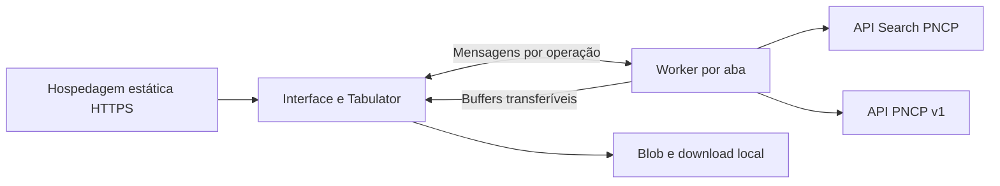

# Execução no navegador e alcance da homologação

Revisão de 8 de outubro de 2026. A migração descrita no [plano de implementação](plano-implementacao-browser.md) está implementada: `npm run build` gera uma aplicação estática, com interface, bibliotecas e Web Worker locais. Pesquisa, filtros, painéis e CSV executam no navegador sem API própria, proxy de aplicação ou funções serverless.

## Arquitetura entregue

Validação, configuração, esquema, projeções, fila PNCP, consistência de coleta e codificação CSV estão no núcleo compartilhado. O núcleo e os módulos do navegador não dependem de Undici, variáveis do processo ou Buffer. O artefato contém somente arquivos estáticos e configuração pública.

Os 80 filtros mantêm os mesmos tipos, domínios e compatibilidade: 71 de contratações, 16 de atas e 32 de contratos. Todos os painéis, contagens, paginação e consultas de registros filhos usam o serviço local.

Cada Worker possui um cliente e uma fila: duas chamadas simultâneas, duas por segundo e quatro operações ativas por padrão. Timeouts, cancelamento e limites de bytes, chamadas e documentos permanecem ativos. A ponte confirma versão, associa resultados por ID, descarta respostas canceladas e rejeita promessas pendentes quando o Worker falha.

A exportação coleta novamente os últimos critérios concluídos, processa páginas e lotes de 25 documentos, verifica total/identidade/duplicação, codifica bytes e transfere buffers somente ao terminar. Metadados são compactos, sem a coleção completa de documentos. A interface mostra progresso e permite cancelar; não baixa arquivo parcial. `lossless-json` preserva precisão durante a leitura e a projeção.

## Evidências atuais

As evidências anteriores de cabeçalhos HTTP permanecem separadas em [`evidencias-browser-pncp.json`](evidencias-browser-pncp.json). A medição desta implementação está em [`evidencias-browser-implementacao.json`](evidencias-browser-implementacao.json).

A nova medição usa Firefox 146 em Linux, página estática em localhost, fetch nativo na página e no Worker, proxy de rede do ambiente e TLS ativo. O certificado do proxy foi confiado somente no perfil temporário de teste. Não houve API/proxy da aplicação, interceptação de respostas, desativação de CORS ou verificação TLS. Foi necessário executar o navegador fora do isolamento de processos que impedia sua inicialização; isso não altera os controles de origem/TLS.

| Verificação | Evidência |
| --- | --- |
| Fetch direto na página | HTTP 200, `type: cors`, JSON legível; cabeçalhos visíveis de conteúdo/cache |
| Buscas de edital, ata e contrato | Dados reais e totais legíveis no Worker |
| Paginação, ordenação e filtro UF | Operações concluídas diretamente |
| `/filters`, `/suggest` e quatro catálogos auxiliares | Respostas processadas pelo Worker |
| Contratação | Itens/quantidade, arquivos/quantidade, histórico/quantidade e listas vinculadas; exemplos adicionais com atas e contrato existentes |
| Ata | Dados completos, partes, contratos, arquivos e histórico; contratos vazios na amostra |
| Contrato | Dados completos, instrumentos de cobrança, termos, arquivos e histórico; algumas listas vazias legítimas |
| Empenhos e alguns registros filhos | HTTP 404 legível nas amostras; não homologa registros positivos inexistentes nessa amostra |
| CORS controlado em Chromium e Firefox | Duas origens reais: JSON legível com permissão, bloqueado sem permissão; `Retry-After` visível somente com exposição explícita |
| Interface estática | 63 verificações em Chromium e 63 em Firefox, com os filtros, três tipos, abas, CSV, teclado e responsividade |
| Exportação sintética | 10.000 documentos, 100 chamadas de busca, 4.264.313 bytes, interface responsiva, cancelamento e reutilização do Worker |

A lista de recursos, identidades e resultados da integração real está no JSON, preservando os resultados medidos. Na aplicação, HTTP 404 equivale a vazio nas listas de contratos vinculados a uma contratação e nas listas de empenhos e instrumentos de cobrança de um contrato; detalhes de registros individuais e outros recursos continuam reportando erro. A demonstração e as fixtures verificam o comportamento de registros positivos dos recursos cuja amostra real não os forneceu.

## Condições de operação

A hospedagem publica apenas `dist-browser/` por HTTPS, na raiz ou em subdiretório. Node.js é necessário para desenvolvimento/build/testes, mas não para executar o artefato publicado. Não é suportado abrir o HTML por `file://`.

Consultas são GET com `mode: cors`, `credentials: omit`, `cache: no-store`, `redirect: error` e Accept simples. A aplicação não envia User-Agent personalizado nem Cache-Control como cabeçalho de requisição. Retry-After só pode ser lido quando a fonte o expõe. Falhas sem resposta legível produzem erro recuperável de transporte, sem status HTTP inventado e sem ativar dados fictícios.

O navegador continua dependendo da internet, disponibilidade e política CORS do PNCP. O portal oficial operar na mesma origem não basta para certificar qualquer outra origem. Respostas sem CORS, inclusive falhas de infraestrutura, podem impedir que o navegador identifique o HTTP real.

## Limites de homologação

A origem HTTPS de produção ainda precisa ser escolhida e verificada com `pncp-diagnostic.html`. O acesso direto aprovado em localhost/Firefox não certifica esse domínio, outros navegadores ou disponibilidade contínua. Safari e um dispositivo móvel real não foram homologados neste ambiente; viewport móvel em testes automatizados não substitui esse ensaio.

A medição de 10.000 documentos usa fonte sintética e ritmo elevado para medir processamento. Com os padrões reais de 50 registros por página e duas chamadas por segundo, o agendamento de 200 buscas consome aproximadamente 100 segundos, próximo do prazo total de 120 segundos. A latência e as tentativas podem interromper a coleta. O CSV continua limitado a 50 MiB, e as respostas a 100 MiB por operação. A medição automatizada não expõe memória total do Worker/Blob; não foi estabelecido um limite garantido para qualquer dispositivo.

Não há PWA, cache persistente, consultas reais offline ou coordenação entre abas.

O [guia de hospedagem](hospedagem-estatica.md) contém comandos, CSP/cache, workflow manual de GitHub Pages e diagnóstico na origem publicada. A promoção da implantação estática depende dessas verificações operacionais, conforme os critérios do plano.
