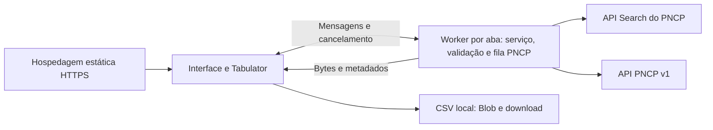

# Viabilidade de execução no navegador

Revisão de 8 de outubro de 2026, sobre o repositório em `5971b45`. As evidências de rede referem-se ao código de `2b24593`, sem alterações de implementação entre esses commits. Esta revisão confere o código e as medições registradas; não acrescenta novas sondagens ao PNCP.

## Parecer

**A arquitetura permite migrar o Compras Web para uma aplicação estática; a operação integral sem backend próprio ainda depende de homologação direta no navegador.** O projeto não usa banco de dados, autenticação própria ou credenciais privadas para acessar o PNCP. As respostas bem-sucedidas das duas famílias de APIs utilizadas apresentaram `Access-Control-Allow-Origin: *`, incluindo pesquisas de contratações, atas e contratos. Isso demonstra uma condição favorável de acesso nas amostras, sem garantir todos os recursos, respostas de erro ou navegadores.

A migração envolve uma refatoração transversal: serviço de consultas, validações hoje feitas nas rotas, transporte HTTP, comunicação com Worker, exportação e distribuição. A interface e grande parte das regras de negócio podem ser reaproveitadas. O [plano de implementação](plano-implementacao-browser.md) define entregas, dependências e critérios de aceite. A validação direta no domínio HTTPS de destino é condição para substituir a implantação atual, mas sua pendência permite avançar na extração do núcleo e nos testes locais.

O navegador continuará dependendo das APIs e da disponibilidade do PNCP para obter dados reais. HTML, CSS, JavaScript e bibliotecas poderão ser publicados em uma hospedagem estática HTTPS, como GitHub Pages ou Cloudflare Pages. Node.js poderá continuar sendo usado para desenvolvimento, testes e build, sem ser necessário na hospedagem da aplicação.

O destino recomendado é uma página servida por HTTP(S). A abertura direta de `index.html` por `file://` tem restrições próprias de origem e módulos e precisaria de uma avaliação separada. Dados reais atualizados continuam exigindo conexão com a internet.

**Este documento é uma avaliação e uma proposta. A versão atual ainda exige o servidor Node.js; `npm run build` ainda produz uma distribuição Node.js.**

## Evidência de acesso ao PNCP

Foram feitas requisições HTTPS reais, com verificação TLS ativa, `Origin: https://compras-web.example`, `Accept: application/json` e os mesmos caminhos usados pela aplicação. Os cabeçalhos e resultados resumidos estão em [Evidências de acesso e CORS](evidencias-browser-pncp.json).

| Família e recurso verificado | Resultado observado | Acesso por outra origem |
| --- | --- | --- |
| `/api/search/`, tipo `edital`, texto `software` | HTTP 200, 10 documentos | `Access-Control-Allow-Origin: *` |
| `/api/search/`, tipo `ata`, texto `software` | HTTP 200, 10 documentos | `Access-Control-Allow-Origin: *` |
| `/api/search/`, tipo `contrato`, texto `software` | HTTP 200, 10 documentos | `Access-Control-Allow-Origin: *` |
| `/api/search/filters` e `/api/search/suggest` | HTTP 200 em tentativas bem-sucedidas | `Access-Control-Allow-Origin: *` |
| `/api/pncp/v1/paises` | HTTP 200, catálogo JSON | `Access-Control-Allow-Origin: *` |
| Itens, quantidade, arquivos, histórico e atas de uma contratação | HTTP 200 | `Access-Control-Allow-Origin: *` |
| Dados completos, partes envolvidas e contratos de uma ata | HTTP 200 | `Access-Control-Allow-Origin: *` |
| Dados completos de contrato, termos, quantidade de termos e instrumentos de cobrança | HTTP 200 | `Access-Control-Allow-Origin: *` |
| Consulta de contratos vinculados a uma contratação | HTTP 404, corpo JSON; a aplicação trata esse caso específico como zero registros | `Access-Control-Allow-Origin: *` |

O portal oficial usa as APIs na mesma origem. Sua existência como aplicação de navegador, por si só, não demonstraria que outro site pode consumi-las; os cabeçalhos acima são a evidência relevante para essa possibilidade.

### Alcance do teste em navegador

A tentativa de conexão direta do Chromium ao PNCP encontrou `ERR_CERT_AUTHORITY_INVALID` para o proxy do ambiente de avaliação. A verificação TLS foi mantida ativa, e essa tentativa ficou inconclusiva quanto ao acesso direto por navegador.

Para verificar o comportamento de CORS separadamente, respostas HTTPS reais foram reproduzidas por um servidor de teste em uma origem local diferente da página, preservando os cabeçalhos CORS e o corpo. O Chromium realizou requisições de rede normais, sem interceptação do Playwright e sem desativar a segurança. Um controle com `Access-Control-Allow-Origin: *` permitiu ler o JSON; outro sem esse cabeçalho foi bloqueado. Respostas reais de busca de atas, filtros, sugestões, catálogo, detalhes de ata/contrato e HTTP 404 também puderam ser lidas quando continham CORS válido.

Esse teste confirma o efeito dos cabeçalhos observados, mas não substitui uma consulta direta ao PNCP a partir da futura hospedagem HTTPS. Não houve homologação de todos os 80 filtros, de todos os recursos dos painéis ou de uma exportação completa no navegador.

Também foram observadas respostas HTTP 503 sem cabeçalhos CORS no caminho de acesso. A origem dessas falhas, entre a API e a infraestrutura intermediária, não foi estabelecida. O teste isolado confirmou que o navegador bloqueia a leitura dessas respostas: a aplicação recebe uma falha de `fetch`, sem conseguir distinguir o HTTP 503 de outros problemas de transporte. Isso precisa ser considerado no tratamento de erros da versão estática.

## O que muda na arquitetura

Hoje, [`public/app.js`](../public/app.js) consulta `/api/schema`, `/api/query`, `/api/export` e rotas locais de filtros e detalhes. O servidor valida, acessa o PNCP e devolve dados já projetados. Publicar apenas `public/` em um serviço estático não faria essas funções operarem.

A arquitetura proposta é:



| Componente atual | Adaptação necessária |
| --- | --- |
| Interface, Tabulator, abas, contadores e paginação | Preservar a interface e substituir chamadas `/api/...` por métodos de um serviço JavaScript local. |
| [`src/schema.js`](../src/schema.js) e catálogo de argumentos | Gerar esquema estático ou incluí-lo no bundle. Preservar colunas, tipos, limites e compatibilidade dos 80 filtros. |
| [`src/validation.js`](../src/validation.js), [`src/filter-domains.js`](../src/filter-domains.js) e [`src/errors.js`](../src/errors.js) | Reaproveitar as regras. A validação local continua conferindo domínios obtidos do PNCP. |
| [`src/adapter.js`](../src/adapter.js), [`src/related.js`](../src/related.js) e [`src/document-details.js`](../src/document-details.js) | Reaproveitar projeções, identidades, campos por tipo e validação de links. Incluir `lossless-json` na distribuição. |
| [`src/pncp.js`](../src/pncp.js) | Separar o cliente e a fila portáveis do transporte Node.js. Injetar `fetch` nativo no navegador; adaptar leitura, identificação de operações, timeouts, redirecionamentos e erros. |
| [`src/query.js`](../src/query.js) | Executar no navegador, preservando filtros, paginação e conferências de consistência; adaptar a produção do CSV. |
| [`src/demo.js`](../src/demo.js) | Incluir os dados sintéticos e uma configuração explícita de demonstração. |
| [`src/config.js`](../src/config.js) | Substituir `process.env` por configuração pública de build ou arquivo estático. |
| [`src/server.js`](../src/server.js) | Extrair validações de domínios, sugestões, identidades e paginação, além do controle de operações. Manter o adaptador HTTP durante a transição; a implantação estática não terá essas rotas nem healthcheck. |
| [`scripts/build.js`](../scripts/build.js) | Acrescentar um build estático independente, com bundles, Worker, configuração pública e bibliotecas locais. Preservar a distribuição Node.js como referência durante a migração. |

As APIs HTTP próprias da aplicação não estarão disponíveis em uma hospedagem estática. Se houver integrações externas dependentes de `/api/query` ou `/api/export`, elas precisarão de adaptação ou da manutenção de uma distribuição Node.js separada.

O acoplamento não se limita a imports de `node:*`: `QueryService` importa `operation` de `pncp.js`, que carrega Undici, e a interface espera objetos `Response` e cabeçalhos HTTP para exportação. Esses limites precisam se tornar interfaces explícitas. As regras de `server.js` devem ser chamadas tanto pelo adaptador HTTP quanto pelo serviço do Worker, para evitar perda de validações na versão estática.

## Adaptações que precisam preservar o comportamento

### Cliente HTTP e segurança

- Usar `GET` nas APIs do PNCP, com `credentials: 'omit'` e cabeçalhos simples, como `Accept`. Os atuais `POST` são destinados ao servidor local, não à busca do PNCP.
- Remover os cabeçalhos personalizados `User-Agent` e `Cache-Control` do cliente atual. O navegador controla o primeiro; o segundo provoca preflight, e não consta na lista de cabeçalhos permitidos observada na API v1. `Access-Control-Allow-Origin: *` exige que a consulta não envie credenciais.
- Usar `cache: 'no-store'` nas consultas para preservar a nova leitura da fonte a cada operação, conferindo o comportamento de cache e preflight nos navegadores-alvo. A política de cache dos assets estáticos pode ser diferente da dos dados.
- Substituir `node:crypto`, `Buffer` e `timeout.unref()` por APIs do navegador: `crypto.randomUUID()`, `TextDecoder`, `TextEncoder` e temporizadores comuns. Manter cancelamento e limites de volume durante a leitura da resposta.
- Separar configurações próprias do servidor das configurações portáveis. O navegador não oferece o timeout de conexão de 5 segundos do agente Undici: devem existir limites de requisição e operação com abort, sem prometer o mesmo controle de conexão. Conferir prazos ao retomar uma aba suspensa.
- Adaptar a verificação de redirecionamentos. Com `redirect: 'manual'`, o navegador pode retornar `opaqueredirect`, sem expor `Location`. Uma opção conservadora é usar os caminhos canônicos com `redirect: 'error'` e tratar redirecionamentos como falhas.
- Manter tentativas limitadas com espera progressiva. `Retry-After` não fica acessível ao JavaScript sem `Access-Control-Expose-Headers`; esse cabeçalho de exposição não apareceu nas respostas verificadas. Usar uma espera local quando a indicação da fonte não puder ser lida.
- Ajustar a política de conteúdo para permitir `connect-src 'self' https://pncp.gov.br` e `worker-src 'self'`. A política atual de conexão permite apenas `'self'`. Workers com URL própria também precisam da política aplicável às suas respostas, conforme a hospedagem. A alternativa por `<meta>` tem limitações: não substitui cabeçalhos como `X-Content-Type-Options` nem a diretiva `frame-ancestors`. Continuar exibindo textos da fonte como texto e validando links.

O navegador não consegue corrigir uma resposta sem CORS. Se o PNCP mudar sua política de acesso, uma implantação totalmente estática dependerá de uma correção na fonte. Acrescentar um proxy ou função serverless criaria novamente um backend próprio.

### Precisão numérica e exportação

`lossless-json` possui distribuição para navegador. Sua utilização deve ser mantida: primeiro ler o corpo como texto, depois interpretar os números com esse parser. Usar diretamente `response.json()` nos dados financeiros pode arredondar valores antes que os adaptadores os convertam para texto.

A coleta e a geração de CSV podem ser feitas localmente, com `TextEncoder` para medir bytes e `Blob` para iniciar o download. Preservar todas as colunas documentais, BOM UTF-8, CRLF, escape de aspas, valores exatos e os últimos critérios concluídos. Manter as verificações de total alterado, página incompleta e documentos duplicados.

O plano adota um Worker dedicado por aba, com um único cliente e uma fila compartilhada entre pesquisa, detalhes e exportação. As respostas devem ser projetadas para objetos simples antes de `postMessage`: instâncias de `LosslessNumber` não podem depender da preservação de seus métodos na clonagem. Erros precisam de serialização explícita, e cancelamento precisa de mensagens por operação; transmitir um `AbortSignal` não estabelece automaticamente esse vínculo.

A exportação deve processar páginas, conferir consistência e acumular bytes CSV sem enviar toda a coleção de documentos à interface. O download só começa após o sucesso da coleta completa. Um Worker evita bloquear a interface, mas não elimina o consumo de memória nem garante que receba cancelamento durante um trecho síncrono longo; a implementação precisa devolver o controle ao loop de eventos em pontos limitados.

O padrão atual de 10.000 documentos, com páginas de 50, pode exigir 200 requisições de busca, além da validação de domínios. O ritmo de duas chamadas por segundo já consome aproximadamente 100 segundos de agendamento, próximo do timeout de operação de 120 segundos, antes de considerar atrasos e tentativas adicionais. O limite de CSV é 50 MiB; documentos, strings e cópias podem consumir mais memória que o arquivo final. Os limites e o timeout precisam de medição em dispositivo móvel e aba em segundo plano. O plano não garante que a configuração atual suporte qualquer coleta de 10.000 registros.

### Filtros e painéis dos três tipos

A migração deve manter os 80 filtros implementados, com sua compatibilidade por documento, serialização e validação de domínios. Ela não exige refazer o catálogo nem substituir a API Search pela API de consulta pública, cujos recursos não devem ser presumidos equivalentes.

Preservar os painéis de contratações, atas e contratos, o carregamento inicial em segundo plano, as contagens separadas, envelopes paginados, recorte local de instrumentos de cobrança e consultas sob demanda de registros filhos. Também manter as identidades distintas: compra e ata possuem sequenciais próprios; um contrato não fornece o sequencial da compra por equivalência.

**HTTP 404 continua significando zero registros somente na consulta de contratos vinculados à contratação**, conforme o comportamento atual. A resposta verificada permite ler esse status por CORS. Uma falha genérica de rede ou CORS não pode ser convertida em lista vazia, e outros HTTP 404 não devem receber essa exceção automaticamente.

### Limites e operação

A fila, o ritmo de duas chamadas por segundo e a concorrência de duas requisições podem ser mantidos por aba. O limite atual de quatro operações simultâneas também precisa migrar do servidor. A fila de duas tarefas do painel de detalhes é uma camada distinta e deve permanecer compatível com o limite global da aba. O backend atual coordena todos os clientes de seu processo; no navegador, abas e usuários passam a ter filas independentes. Coordenação por `BroadcastChannel` ou SharedWorker fica como evolução posterior, sem controle global entre usuários.

O diagnóstico de disponibilidade passa a depender das consultas e das mensagens da interface. A versão estática não terá `/api/health` nem os logs centralizados do servidor. A configuração entregue ao navegador será pública; o acesso atual ao PNCP não precisa de segredos.

## Caminho recomendado

O [plano de implementação](plano-implementacao-browser.md) organiza a migração em sete entregas: prova de acesso direto, extração do núcleo, build estático, transporte e Worker, integração da interface, exportação e homologação. O build entra no início para permitir testes reais do Worker e dos imports de bibliotecas durante o desenvolvimento.

Os testes atuais de interface e o smoke test usam o serviço Node.js e respostas sintéticas. Eles precisam ser adaptados para exercitar uma distribuição servida apenas como arquivos estáticos. Simulações de respostas continuam úteis para os 80 filtros e situações de erro, mas uma interceptação do navegador não comprova CORS; o teste direto de produção é uma validação separada.

A publicação definitiva depende do acesso direto, da equivalência funcional e da medição de recursos. A distribuição Node.js serve como referência e opção de retorno até esses critérios serem atendidos. Hospedagem, comandos e arquivos sugeridos no plano ainda não foram implementados.

## Como repetir uma checagem direta

Em uma página estática HTTPS de origem diferente de `pncp.gov.br`, com uma política de conteúdo que permita a conexão, execute no console do navegador:

```js
const url = 'https://pncp.gov.br/api/search/?tipos_documento=ata&status=todos&ordenacao=-data&pagina=1&tam_pagina=10&q=software';
const response = await fetch(url, {
  mode: 'cors',
  credentials: 'omit',
  cache: 'no-store',
  redirect: 'error',
  headers: { Accept: 'application/json' },
});
console.log(response.status, response.type, response.headers.get('content-type'));
const body = await response.text();
console.log(body.slice(0, 160));
```

Uma resposta JSON legível com `response.type === 'cors'` comprova o acesso àquele endpoint naquela tentativa. Repetir com outros tipos e recursos é necessário; apenas um resultado positivo não homologa a integração inteira. O trecho acima inspeciona texto; o serviço da aplicação deve usar `lossless-json` para interpretar números.
